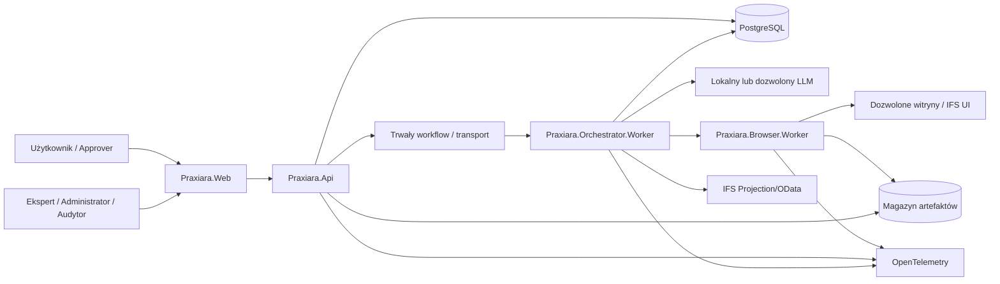
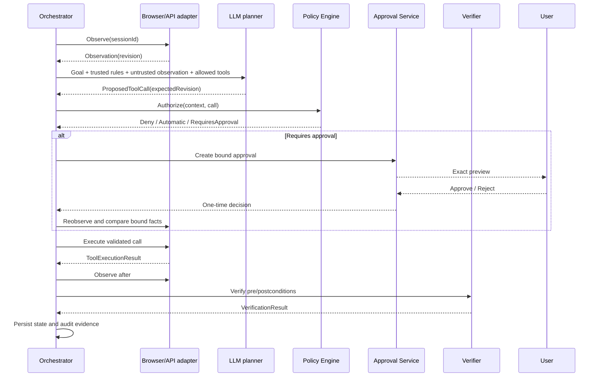
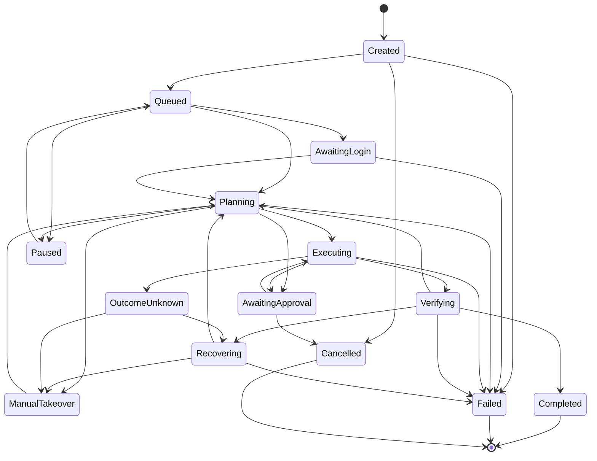

# Plan wytworzenia platformy Praxiara

## 1. Status i przeznaczenie dokumentu

Ten dokument opisuje drogę od obecnego szkieletu rozwiązania do kompletnej, produkcyjnej platformy Praxiara. Plan dotyczy produktu docelowego, a nie ograniczonej wersji demonstracyjnej ani MVP. Kolejne fazy służą redukcji ryzyka i kontrolowanemu uruchamianiu funkcji, ale nie zmniejszają docelowego zakresu produktu.

Plan jest dokumentem sterującym dla:

- właściciela produktu i właścicieli procesów biznesowych;
- architektów i zespołu wytwórczego;
- ekspertów IFS Cloud tworzących i certyfikujących skills;
- zespołów bezpieczeństwa, zgodności, ochrony danych i audytu;
- zespołu platformowego, SRE i wsparcia produkcyjnego;
- osób zatwierdzających operacje wykonywane przez agenta.

Dokument powinien być aktualizowany po każdej istotnej decyzji architektonicznej, zmianie modelu ryzyka, zmianie zakresu produktu albo zmianie wymagań regulacyjnych. Rozbieżność między implementacją a tym planem wymaga aktualizacji planu albo jawnego ADR opisującego odstępstwo.

### 1.1. Konwencje językowe

- Pliki Markdown w repozytorium oraz interakcje z użytkownikiem są prowadzone po polsku.
- Kod, identyfikatory, komentarze w kodzie, XML documentation, JSDoc, nazwy testów, komunikaty techniczne i kontrakty API są tworzone po angielsku.
- Teksty interfejsu użytkownika są domyślnie polskie, ale od początku korzystają z mechanizmu internacjonalizacji.
- Fragmenty kodu i nazwy stanów w tym dokumencie pozostają po angielsku, ponieważ są częścią kontraktu technicznego.

## 2. Wizja produktu

Praxiara jest bezpieczną platformą wykonywania zadań w aplikacjach internetowych przez kontrolowanego agenta LLM. Użytkownik formułuje cel, obserwuje plan i przebieg, zatwierdza operacje niosące skutki biznesowe oraz może w każdej chwili przejąć przeglądarkę. Agent korzysta z izolowanego Chromium, ale nie otrzymuje nieograniczonego dostępu do przeglądarki, systemu operacyjnego ani sieci.

Mechanizm docelowy ma postać:

```text
User intent
  -> deterministic orchestration
  -> LLM proposes one typed action
  -> independent policy decision
  -> optional bound approval
  -> skill-guided execution
  -> Playwright or IFS Projection API
  -> business verification
  -> immutable audit evidence
```

Najważniejszym wyspecjalizowanym zastosowaniem Praxiary jest IFS Cloud. Dla IFS platforma łączy:

- wysokopoziomowe operacje domenowe;
- wersjonowane skills opisujące procesy;
- oficjalne Projection/OData API, kiedy jest dostępne;
- Playwright dla operacji wymagających interfejsu użytkownika;
- niezależne asercje przed i po działaniu;
- polityki ryzyka oraz zatwierdzenia człowieka;
- pełny, możliwy do zweryfikowania audyt.

Praxiara ma również obsługiwać inne witryny, jednak poziom gwarantowanej niezawodności zależy od stopnia ich integracji. Dla certyfikowanych skills i adapterów domenowych obowiązują wysokie wymagania jakościowe. Dla ogólnej nawigacji po skonfigurowanych witrynach system zapewnia bezpieczne działanie best effort, bez obietnicy automatyzacji każdego interfejsu.

## 3. Cele i mierzalne rezultaty

### 3.1. Cele biznesowe

1. Skrócenie czasu wykonywania powtarzalnych procesów w IFS Cloud i innych aplikacjach webowych.
2. Ograniczenie błędów ręcznych przez jawne preconditions, postconditions i weryfikację danych.
3. Zachowanie odpowiedzialności człowieka za operacje wysokiego ryzyka.
4. Umożliwienie ekspertom biznesowym nagrywania i utrzymywania procedur bez modyfikowania kodu aplikacji przy każdej zmianie procesu.
5. Zapewnienie audytorom kompletnego dowodu: kto, kiedy, w jakim środowisku, na jakim rekordzie, przy użyciu jakiej wersji skill/modelu/polityki wykonał operację.
6. Uniezależnienie rdzenia produktu od jednego dostawcy LLM.
7. Utrzymanie stosu narzędzi i bibliotek, które mogą być używane komercyjnie bez opłat licencyjnych, z jawnie kontrolowanymi obowiązkami licencyjnymi.

### 3.2. Cele techniczne

1. LLM nigdy nie wykonuje kodu bezpośrednio; zwraca wyłącznie ustrukturyzowaną decyzję.
2. Każda akcja jest wykonywana na podstawie aktualnej rewizji obserwacji strony.
3. Każda operacja skutkowa jest autoryzowana przez Policy Engine niezależny od modelu.
4. Każda operacja R4 lub R5 jest związana z konkretnym approval i nie może zostać wykonana po zmianie zatwierdzonego kontekstu.
5. Sesje różnych użytkowników są odseparowane co najmniej na poziomie procesu lub efemerycznego kontenera wykonawczego.
6. Dla IFS zawsze najpierw oceniana jest możliwość użycia oficjalnego API.
7. Wszystkie ścieżki krytyczne są obserwowalne przez OpenTelemetry i posiadają mierzalne SLO.

## 4. Zasady nadrzędne

1. **Safety before autonomy** — autonomia nie może omijać polityk bezpieczeństwa.
2. **API-first for IFS** — UI jest mechanizmem uzupełniającym, nie domyślnym.
3. **Fail closed** — nieznane narzędzie, domena, uprawnienie, stan albo wynik oznacza zatrzymanie, nie zgadywanie.
4. **One observation, one revision** — referencje elementów są krótkotrwałe i związane z rewizją strony.
5. **One proposed effect at a time** — model proponuje pojedynczą atomową akcję.
6. **Evidence over assumption** — kliknięcie przycisku nie oznacza sukcesu; sukces wymaga postcondition.
7. **Human authority is explicit** — zatwierdzenie pokazuje rzeczywisty rekord, wartości, środowisko i skutek.
8. **Page content is untrusted** — treść witryny jest danymi, nigdy źródłem poleceń nadrzędnych.
9. **Least privilege and least data** — minimalne narzędzia, domeny, dane, retencja i uprawnienia.
10. **Reproducible operation** — wersje modelu, promptu, skill, polityki i kontraktu są zapisane w audycie.
11. **Commercially usable dependencies** — każda zależność i każdy model przechodzi kontrolę licencji.
12. **No hidden production paths** — nie istnieje produkcyjna funkcja skutkowa bez polityki, audytu, testów i runbooka.

## 5. Zakres produktu

### 5.1. Zakres włączony

- aplikacja webowa React do rozmowy z agentem, nadzoru zadania i administracji;
- API i komunikacja czasu rzeczywistego w ASP.NET Core 10;
- trwała orkiestracja z checkpointami, retry, limitami i recovery;
- wymienialna warstwa LLM oparta na `Microsoft.Extensions.AI`;
- lokalny provider LLM jako bezpłatny wariant referencyjny;
- izolowane sesje Chromium zarządzane przez Playwright .NET;
- semantyczne obserwacje ARIA, formularzy, tabel, dialogów i komunikatów;
- kontrolowany zestaw narzędzi przeglądarkowych i domenowych;
- live view przeglądarki oraz ręczne przejęcie sterowania;
- obsługa kart, popupów, ramek, uploadów i downloadów;
- Policy Engine, poziomy R0–R5, approvals i reauthentication;
- skills w trybach `Observe`, `Assist` i `Execute`;
- recorder procesów, edytor, walidator, testowanie, publikacja i rollback skill;
- adapter IFS Cloud, profile środowisk, Projection/OData i routing hybrydowy;
- ścieżka integracji z IFS Aurena Agent na zarządzanej stacji Windows;
- audyt, screenshoty, Playwright traces, redakcja i kontrolowany replay;
- zarządzanie użytkownikami, rolami, środowiskami, domenami, modelami i retencją;
- obserwowalność, alertowanie, SLO, backup i disaster recovery;
- test sites, evals agentowe, testy bezpieczeństwa i kompatybilności IFS;
- obrazy OCI i wdrożenia oparte na Docker Engine; docelowy profil wysokiej dostępności;
- mechanizmy zgodności z RODO i rozdzielenia tenantów.

### 5.2. Zakres wyłączony

- przekazywanie loginów, haseł, kodów MFA lub surowych cookies do LLM;
- obchodzenie CAPTCHA, zabezpieczeń antybotowych, MFA lub ograniczeń regulaminowych witryn;
- dowolne wykonywanie JavaScriptu, shella albo komend systemowych wygenerowanych przez model;
- nieograniczone żądania HTTP do URL wybranych przez model;
- automatyzacja pulpitu i lokalnych aplikacji poza jawnie zaprojektowanym companionem Aurena;
- zastępowanie mechanizmu uprawnień IFS lub uzyskiwanie uprawnień, których użytkownik nie posiada;
- uczenie własnego modelu bazowego;
- gwarancja poprawnego działania na każdej istniejącej witrynie;
- autonomiczne R4/R5 bez polityki i wymaganego udziału człowieka;
- zależność produktu od płatnego API albo komponentu o licencji niedopuszczającej bezpłatnego użycia komercyjnego;
- przechowywanie poświadczeń witryn w zwykłej bazie danych, plikach konfiguracyjnych lub logach;
- wykonywanie procesów biznesowych bez właściciela procesu i zdefiniowanych kryteriów weryfikacji.

### 5.3. Założenia i ograniczenia

- Organizacja posiada legalny dostęp i odpowiednie uprawnienia do automatyzowanych środowisk IFS oraz innych witryn.
- Właściciele witryn dopuszczają automatyzację w zakresie objętym wdrożeniem.
- Dla procesów IFS dostępne będzie środowisko testowe z reprezentatywną konfiguracją i danymi syntetycznymi.
- Wersja React, Playwright, Chromium, SDK .NET i zależności jest przypinana w lockfile/central package management; określenie „najnowsza” nie oznacza automatycznych, nieprzetestowanych aktualizacji produkcyjnych.
- Docker oznacza obrazy OCI oraz Docker Engine/Compose. Projekt nie może wymagać Docker Desktop, którego warunki bezpłatnego użycia komercyjnego są ograniczone.
- Bezpłatność runtime LLM nie rozstrzyga licencji konkretnego modelu. Każdy model musi mieć osobny wpis w rejestrze licencji i dozwolonych zastosowań.

## 6. Persony, role i rozdzielenie obowiązków

| Persona/rola | Odpowiedzialność | Kluczowe uprawnienia | Ograniczenia |
|---|---|---|---|
| Użytkownik końcowy | Zleca zadania i obserwuje ich wykonanie | Uruchamianie dozwolonych skills, własne sesje, ręczne przejęcie | Nie publikuje skills i nie zmienia globalnych polityk |
| Approver | Zatwierdza operacje skutkowe | Approval dla określonych procesów, środowisk i limitów | Nie zatwierdza poza zakresem delegacji; polityka może zakazać self-approval |
| Ekspert IFS | Opisuje procesy IFS i ocenia poprawność biznesową | Recorder, edycja draftów, testy, proponowanie publikacji | Nie może samodzielnie zatwierdzić produkcyjnej publikacji, jeśli obowiązuje four-eyes |
| Właściciel procesu | Odpowiada za semantykę i ryzyko procesu | Akceptacja postconditions, klasy ryzyka, wersji skill | Nie zarządza infrastrukturą ani sekretami |
| Reviewer skill | Niezależnie sprawdza nagranie i definicję | Review, podpisanie wersji skill | Nie modyfikuje opublikowanej wersji; zmiana tworzy nową wersję |
| Administrator bezpieczeństwa | Definiuje granice zaufania | Role, polityki, domeny, egress, klasyfikacja narzędzi | Nie wykonuje procesów biznesowych w imieniu użytkownika |
| Administrator integracji | Konfiguruje IFS i inne witryny | Profile środowisk, Projection allowlist, route registry | Nie otrzymuje danych uwierzytelniających użytkowników |
| Administrator platformy/SRE | Utrzymuje dostępność | Deployment, skalowanie, backup, observability | Dostęp do treści audytu tylko w trybie break-glass |
| Audytor | Weryfikuje historię i dowody | Odczyt audytu, eksport, weryfikacja integralności | Brak możliwości wykonania lub zmiany akcji |
| Inspektor ochrony danych | Nadzoruje zgodność z RODO | Retencja, żądania podmiotu danych, DPIA | Dostęp minimalny do treści; preferowane metadane i redakcja |
| Support operator | Diagnozuje problemy | Zredagowane telemetry i kontrolowany replay | Bez dostępu do aktywnych sesji bez zgody i audytowanego break-glass |
| Service identity | Komunikacja między procesami | Minimalny scope per usługa | Brak logowania interaktywnego i współdzielonych sekretów |

Minimalny model ról powinien korzystać z RBAC, a ograniczenia per środowisko, skill, tenant, rekord i wartość z ABAC. Operacje administracyjne i publikacja skill wymagają separation of duties.

## 7. Scenariusze docelowe

### 7.1. Zadanie tylko do odczytu

1. Użytkownik wybiera profil witryny i podaje cel.
2. Praxiara tworzy zadanie, przydziela izolowaną sesję i prosi o ręczne logowanie, jeśli jest potrzebne.
3. Orchestrator wybiera dozwolone narzędzia oraz pasujące skills.
4. LLM proponuje nawigację lub odczyt.
5. Policy Engine zezwala na R0/R1.
6. Browser Worker lub adapter API wykonuje akcję.
7. Verifier sprawdza oczekiwany stan.
8. UI pokazuje wynik i kompletną oś czasu.

### 7.2. Operacja skutkowa w IFS

1. Użytkownik zleca np. przygotowanie i wysłanie dokumentu.
2. Adapter IFS pobiera dane przez Projection API, jeśli pozwala na to profil.
3. Skill prowadzi proces do punktu skutkowego.
4. Praxiara tworzy approval zawierające środowisko, rekord, odbiorcę, wartości i skutek.
5. Approval zostaje związane z kanonicznym hashem akcji.
6. Po zatwierdzeniu system ponownie obserwuje stan i waliduje wszystkie bound facts.
7. Operacja jest wykonywana tylko przy niezmienionym kontekście.
8. Verifier potwierdza skutek przez UI i API.
9. Audyt zapisuje dowody i wersje wszystkich artefaktów decyzyjnych.

### 7.3. Ręczne przejęcie

1. Użytkownik wybiera „Przejmij sterowanie” albo recovery wymaga interwencji.
2. Orchestrator zatrzymuje planowanie i oddaje wyłączny lease wejścia użytkownikowi.
3. Użytkownik obsługuje MFA, nietypowy dialog lub wykonuje krok ręczny.
4. Po zwrocie sterowania stary rejestr elementów jest unieważniany.
5. Agent wykonuje nową obserwację i nie zakłada, że wcześniejszy plan jest nadal poprawny.

### 7.4. Nagranie i publikacja skill

1. Ekspert rozpoczyna sesję recorder w środowisku nieprodukcyjnym.
2. Recorder zapisuje obserwacje przed/po, działania, komunikaty, sieć, screenshoty i timing.
3. Generator tworzy draft, parametryzuje dane i wskazuje potencjalne operacje ryzykowne.
4. Ekspert usuwa dane testowe, definiuje preconditions, assertions, recovery i postconditions.
5. Skill przechodzi walidację schematu, testy replay, security review i przegląd właściciela procesu.
6. Opublikowana wersja jest niezmienna, podpisana i wdrażana kontrolowanym kanałem.

## 8. Wymagania funkcjonalne

### 8.1. Tożsamość i autoryzacja

- **FR-ID-001:** aplikacja musi uwierzytelniać użytkownika przez OIDC/OAuth 2.1 z PKCE.
- **FR-ID-002:** backend musi walidować issuer, audience, czas życia i podpis tokenu.
- **FR-ID-003:** role aplikacyjne, role tenantowe i uprawnienia procesowe muszą być rozdzielone.
- **FR-ID-004:** każda komenda musi być autoryzowana po stronie serwera; UI nie jest granicą bezpieczeństwa.
- **FR-ID-005:** service identities muszą używać krótkotrwałych poświadczeń albo mTLS.
- **FR-ID-006:** uprawnienia IFS pozostają uprawnieniami użytkownika; Praxiara nie może ich rozszerzać.
- **FR-ID-007:** operacje R5 i wskazane R4 muszą wspierać step-up authentication.
- **FR-ID-008:** self-approval musi być konfigurowalne per polityka i domyślnie zabronione dla krytycznych procesów.
- **FR-ID-009:** dostęp break-glass musi być czasowy, uzasadniony i audytowany.
- **FR-ID-010:** odebranie roli lub unieważnienie sesji musi zatrzymać oczekujące wykonania najpóźniej przed kolejną akcją.

### 8.2. Zadania i orkiestracja

- **FR-TASK-001:** użytkownik może utworzyć zadanie z celem, profilem witryny, preferowanym trybem i opcjonalnymi parametrami.
- **FR-TASK-002:** system musi walidować, czy cel mieści się w dozwolonym profilu i polityce.
- **FR-TASK-003:** każde zadanie posiada niezmienny `TaskId`, właściciela, tenant, datę utworzenia i correlation ID.
- **FR-TASK-004:** zadania wspierają anulowanie, pauzę, wznowienie i timeout.
- **FR-TASK-005:** trwały checkpoint musi umożliwiać bezpieczne wznowienie po restarcie workera.
- **FR-TASK-006:** wznowienie nigdy nie może automatycznie powtórzyć niepotwierdzonej akcji nieidempotentnej.
- **FR-TASK-007:** maksymalna liczba kroków, replanów, retry i czas zadania są konfigurowalne.
- **FR-TASK-008:** orchestrator musi wykrywać pętle i powtarzające się obserwacje bez postępu.
- **FR-TASK-009:** plan i historia stanów są widoczne w UI w czasie rzeczywistym.
- **FR-TASK-010:** użytkownik może dodać doprecyzowanie bez utraty poprzedniego audytu; zmiana celu tworzy nową rewizję celu.
- **FR-TASK-011:** równoległe zadania tego samego użytkownika nie mogą używać tej samej sesji bez jawnej polityki.
- **FR-TASK-012:** zadanie musi kończyć się jednoznacznym statusem oraz podsumowaniem opartym na zweryfikowanych danych.

### 8.3. LLM i planowanie

- **FR-LLM-001:** `Praxiara.Llm` musi implementować provider-neutral `IChatClient` oraz rejestr modeli.
- **FR-LLM-002:** model otrzymuje wyłącznie narzędzia dozwolone dla danego użytkownika, skill, domeny i etapu.
- **FR-LLM-003:** odpowiedź modelu musi być zgodna z wersjonowanym schematem structured output.
- **FR-LLM-004:** model może zwrócić dokładnie jedną akcję, żądanie doprecyzowania albo sygnał zakończenia.
- **FR-LLM-005:** backend waliduje tool name, argumenty, rozmiary, enumy i formaty przed Policy Engine.
- **FR-LLM-006:** kontekst strony jest oznaczony jako niezaufany i oddzielony od instrukcji systemowych.
- **FR-LLM-007:** prompt, wersja promptu, model, parametry inferencji i tool catalog version muszą być audytowane.
- **FR-LLM-008:** timeout, brak providera, niepoprawny format i odmowa modelu muszą mieć bezpieczną ścieżkę recovery.
- **FR-LLM-009:** memory długoterminowe nie może przyjmować treści strony automatycznie.
- **FR-LLM-010:** routing modelu uwzględnia wymagane możliwości, klasyfikację danych, licencję, dostępny sprzęt i budżet zasobów.
- **FR-LLM-011:** system musi wspierać deterministyczne evals na przypiętej wersji modelu.
- **FR-LLM-012:** zmiana modelu lub głównego promptu wymaga regresji evals przed promocją.

### 8.4. Sesje przeglądarki

- **FR-BRW-001:** każda sesja użytkownika jest uruchamiana w izolowanym procesie lub efemerycznym kontenerze Browser Worker.
- **FR-BRW-002:** `BrowserContext` nie może być współdzielony między użytkownikami.
- **FR-BRW-003:** sesja ma jawny TTL, heartbeat, owner lease i proces cleanup.
- **FR-BRW-004:** użytkownik loguje się do witryny ręcznie i sam obsługuje MFA.
- **FR-BRW-005:** stan uwierzytelnienia nie jest domyślnie utrwalany.
- **FR-BRW-006:** opcjonalny persisted state jest szyfrowany kluczem per tenant/użytkownik, ma krótki TTL i revoke.
- **FR-BRW-007:** Playwright tracing może być włączony zgodnie z polityką danych i retencji.
- **FR-BRW-008:** live view musi pokazywać aktualną kartę, stan połączenia i właściciela sterowania.
- **FR-BRW-009:** manual takeover ustanawia wyłączny lease wejścia i zatrzymuje działania agenta.
- **FR-BRW-010:** zwrot sterowania unieważnia obserwację i wymusza reobserve.
- **FR-BRW-011:** popupy, dialogi, downloady i uploady muszą mieć jawne, audytowane zdarzenia.
- **FR-BRW-012:** zamknięcie zadania usuwa tymczasowy profil, pliki i procesy zgodnie z retencją.
- **FR-BRW-013:** awaria Browser Worker musi zostać wykryta, a task nie może udawać sukcesu.
- **FR-BRW-014:** przeglądarka i Playwright muszą być aktualizowane w kontrolowanym cyklu bezpieczeństwa.

### 8.5. Obserwacje i referencje elementów

- **FR-OBS-001:** obserwacja zawiera `Revision`, URL, tytuł, elementy semantyczne, komunikaty, dialogi, stan downloadu i opcjonalny screenshot.
- **FR-OBS-002:** obserwacja nie powinna domyślnie zawierać całego HTML ani skryptów strony.
- **FR-OBS-003:** elementy są opisywane przez rolę, nazwę dostępną, wartość, widoczność i enabled state.
- **FR-OBS-004:** `ElementReferenceRegistry` jest ważny wyłącznie dla jednej rewizji.
- **FR-OBS-005:** akcja z nieaktualnym `ExpectedPageRevision` jest odrzucana bez wykonania.
- **FR-OBS-006:** snapshot musi uwzględniać iframe, Shadow DOM i wirtualizowane tabele w zakresie wspieranym przez adapter.
- **FR-OBS-007:** priorytet locatorów to ARIA role/name, label, tekst, stabilny atrybut, relacja semantyczna, CSS, wizja, współrzędne.
- **FR-OBS-008:** XPath i współrzędne są mechanizmem ostatecznym i wymagają dodatkowej weryfikacji.
- **FR-OBS-009:** screenshot przekazywany do modelu musi być redagowany, jeśli obejmuje pola wrażliwe.
- **FR-OBS-010:** obserwacje muszą mieć limit rozmiaru i deterministyczną kolejność elementów.

### 8.6. Narzędzia

- **FR-TOOL-001:** narzędzia są rejestrowane w wersjonowanym katalogu z JSON Schema, klasą ryzyka, wymaganym permission i consequence.
- **FR-TOOL-002:** minimalny katalog odczytu obejmuje obserwację URL, tytułu, formularza, tabeli, komunikatów i screenshotu.
- **FR-TOOL-003:** katalog nawigacji obejmuje navigate, back, click, fill, select, check, press, wait, scroll oraz zarządzanie kartami.
- **FR-TOOL-004:** upload, download i potwierdzanie dialogów posiadają osobne polityki.
- **FR-TOOL-005:** operacje IFS są eksponowane modelowi jako narzędzia wysokopoziomowe, gdy dostępny jest adapter domenowy.
- **FR-TOOL-006:** model nie otrzymuje `execute_javascript`, `execute_shell`, `set_cookie`, nieograniczonego `http_request` ani dowolnej ścieżki pliku.
- **FR-TOOL-007:** jeśli kod wykonawczy używa JavaScriptu wewnętrznie, skrypt jest statycznym, przeglądanym zasobem aplikacji, a nie treścią modelu.
- **FR-TOOL-008:** każde narzędzie posiada preconditions, timeout, retry policy, idempotency semantics i verifier.
- **FR-TOOL-009:** zmiana klasy ryzyka narzędzia wymaga review bezpieczeństwa oraz nowej wersji katalogu.
- **FR-TOOL-010:** nieznane narzędzie lub argument skutkuje denial i zdarzeniem bezpieczeństwa.

### 8.7. Policy Engine i approvals

- **FR-POL-001:** Policy Engine działa niezależnie od LLM i nie przyjmuje klasy ryzyka zaproponowanej przez model.
- **FR-POL-002:** decyzja uwzględnia użytkownika, tenant, role, skill, narzędzie, środowisko, domenę, rekord, wartości i czas.
- **FR-POL-003:** domyślną decyzją dla braku polityki jest deny.
- **FR-POL-004:** nawigacja oraz każdy redirect muszą pozostać w dozwolonym zakresie domen i sieci.
- **FR-POL-005:** R4 wymaga approval, chyba że jawnie udokumentowana polityka organizacji ustanowi bezpieczniejszy, równoważny mechanizm.
- **FR-POL-006:** R5 zawsze wymaga silnego approval, a wybrane operacje również zasady four-eyes.
- **FR-POL-007:** approval zawiera zrozumiały podgląd operacji oraz techniczny action hash.
- **FR-POL-008:** action hash obejmuje co najmniej tenant, user, task, session, tool, canonical arguments, target, environment, revision, skill/policy version, nonce i expiry.
- **FR-POL-009:** przed wykorzystaniem approval system ponownie obserwuje stronę i porównuje bound facts.
- **FR-POL-010:** approval jest jednorazowy i przechodzi do `Consumed` tylko razem z próbą wykonania powiązanej akcji.
- **FR-POL-011:** zmiana parametrów, rewizji, rekordu, środowiska, skill lub polityki unieważnia approval.
- **FR-POL-012:** odrzucenie i wygaśnięcie są nieodwracalne; ponowienie wymaga nowego approval.

### 8.8. Skills

- **FR-SKL-001:** skill zawiera identyfikator, semver, site, inputs, permissions, risk, preconditions, kroki, postconditions i recovery.
- **FR-SKL-002:** inputs posiadają typ, required, validation, sensitivity i reguły redakcji.
- **FR-SKL-003:** kroki korzystają wyłącznie z narzędzi obecnych w zatwierdzonym katalogu.
- **FR-SKL-004:** skill definiuje tryby `Observe`, `Assist` i `Execute`.
- **FR-SKL-005:** `Observe` nie wykonuje akcji skutkowych, `Assist` przygotowuje dane bez finalnego commit, `Execute` działa zgodnie z polityką.
- **FR-SKL-006:** wersja opublikowana jest niezmienna i posiada podpis/checksum.
- **FR-SKL-007:** skill przechodzi walidację schema, semantic validation, replay, testy bezpieczeństwa i review biznesowy.
- **FR-SKL-008:** publikacja i rollback są audytowane.
- **FR-SKL-009:** system przechowuje macierz kompatybilności skill z witryną, wersją IFS, locale i customizacjami.
- **FR-SKL-010:** błąd precondition zatrzymuje proces przed skutkiem, a błąd postcondition uruchamia recovery lub eskalację.
- **FR-SKL-011:** skill może definiować alternatywne nazwy elementów dla różnych locale, ale identyfikatory domenowe pozostają stabilne.
- **FR-SKL-012:** skill może oznaczać kroki wymagające route `ProjectionApi`, `Browser` lub `Hybrid`.

### 8.9. Recorder

- **FR-REC-001:** recorder zapisuje URL/route, obserwację przed i po, akcję, locator, wartość, komunikaty, timing i screenshot.
- **FR-REC-002:** rejestracja sieci musi podlegać allowliście i redakcji nagłówków, tokenów i payloadów.
- **FR-REC-003:** wpisane sekrety muszą być oznaczane jako sensitive i nie mogą trafić do draftu w postaci jawnej.
- **FR-REC-004:** generator tworzy draft, ale nigdy nie publikuje go samodzielnie.
- **FR-REC-005:** ekspert może parametryzować dane, dodawać asercje, ryzyko i recovery.
- **FR-REC-006:** recorder powinien sugerować Projection API wykryte w ruchu, bez kopiowania tokenów.
- **FR-REC-007:** draft musi wskazywać elementy kruche, np. współrzędne, XPath lub locale-specific text.
- **FR-REC-008:** replay draftu jest wykonywany w środowisku nieprodukcyjnym na danych syntetycznych.
- **FR-REC-009:** każde ręczne zastąpienie sugerowanej klasy ryzyka wymaga uzasadnienia.
- **FR-REC-010:** recorder ma tryb maskowania obszarów ekranu oraz pól wrażliwych.

### 8.10. IFS Cloud

- **FR-IFS-001:** każde środowisko IFS ma profil z `BaseUri`, tenant, locale, environment kind i allowlistą projections.
- **FR-IFS-002:** środowiska produkcyjne są wizualnie i technicznie odróżnione od nieprodukcyjnych.
- **FR-IFS-003:** adapter odkrywa lub importuje kontrakty przez API Explorer/`$openapi` w kontrolowanym procesie administracyjnym.
- **FR-IFS-004:** `IIfsOperationRouter` wybiera `ProjectionApi`, `Browser` lub `Hybrid` według registry, polityki i możliwości środowiska.
- **FR-IFS-005:** odczyt i walidacja danych powinny używać Projection API, jeśli jest oficjalnie dostępne i dozwolone.
- **FR-IFS-006:** operacja API musi zachować kontekst użytkownika i nie może korzystać z szerszego service account bez odrębnej, zatwierdzonej decyzji.
- **FR-IFS-007:** akcje OData muszą być walidowane względem importowanego kontraktu i allowlisty.
- **FR-IFS-008:** dla routingu hybrydowego wynik UI powinien być, gdy możliwe, potwierdzany ponownym odczytem API.
- **FR-IFS-009:** adapter obsługuje odmowę uprawnień, wygasłą sesję, konflikt wersji i błąd biznesowy jako różne typy wyniku.
- **FR-IFS-010:** zmiana release update IFS uruchamia zestaw testów kompatybilności certyfikowanych skills.
- **FR-IFS-011:** custom pages i custom projections mają osobne profile zgodności.
- **FR-IFS-012:** funkcje zależne od Aurena Agent korzystają z jawnego profilu Windows companion i nie są udawane w serwerowym Chromium.
- **FR-IFS-013:** companion Aurena wymaga obecności użytkownika, rejestracji urządzenia, bezpiecznego kanału i osobnej polityki.
- **FR-IFS-014:** brak companion lub niewspierana funkcja powoduje czytelne zatrzymanie, nie fallback do niebezpiecznej metody.

### 8.11. Audyt i replay

- **FR-AUD-001:** audyt obejmuje task, session, user, tenant, timestamp, environment, URL, observation hash, tool, arguments, authorization, approval, result, verification, model, prompt, skill i policy versions.
- **FR-AUD-002:** sensitive arguments są redagowane przed trwałym zapisem.
- **FR-AUD-003:** zdarzenia są append-only i powiązane hash chain lub równoważnym mechanizmem wykrywania modyfikacji.
- **FR-AUD-004:** screenshoty, traces i pliki są przechowywane jako artefakty z checksumą i kontrolą dostępu.
- **FR-AUD-005:** awaria zapisu audytu przed operacją skutkową blokuje R4/R5.
- **FR-AUD-006:** użytkownik widzi zrozumiałą oś czasu, a audytor pełny, autoryzowany widok techniczny.
- **FR-AUD-007:** replay domyślnie nie wykonuje skutków i działa na zarejestrowanych obserwacjach.
- **FR-AUD-008:** live replay wymaga osobnej zgody, środowiska nieprodukcyjnego i nowych approvals.
- **FR-AUD-009:** eksport audytu jest podpisany, ma manifest i jest audytowany.
- **FR-AUD-010:** usunięcie artefaktu zgodnie z retencją pozostawia metadane oraz dowód jego wcześniejszej integralności, jeśli wymaga tego polityka.

### 8.12. Pliki

- **FR-FILE-001:** upload korzysta wyłącznie z artefaktu wcześniej przekazanego przez użytkownika lub wygenerowanego przez zatwierdzone narzędzie.
- **FR-FILE-002:** model nigdy nie wybiera dowolnej ścieżki hosta.
- **FR-FILE-003:** pliki są ograniczane rozmiarem, typem, tenantem, zadaniem i TTL.
- **FR-FILE-004:** pliki opuszczające izolowaną sesję przechodzą kwarantannę i skan antymalware, jeśli wymaga tego polityka.
- **FR-FILE-005:** download nie jest automatycznie otwierany ani wykonywany.
- **FR-FILE-006:** każdy transfer ma checksumę, źródło, odbiorcę i zdarzenie audytowe.
- **FR-FILE-007:** nazwy plików są normalizowane i nie mogą powodować path traversal.

### 8.13. Administracja

- **FR-ADM-001:** administrator zarządza tenantami, rolami, witrynami, domenami, environment profiles i limitami.
- **FR-ADM-002:** administrator bezpieczeństwa zarządza katalogiem narzędzi, poziomami ryzyka i politykami approval.
- **FR-ADM-003:** administrator modeli prowadzi rejestr modeli, licencji, klasyfikacji danych i wyników evals.
- **FR-ADM-004:** konfiguracja produkcyjna jest wersjonowana, audytowana i wdrażana przez kontrolowany proces.
- **FR-ADM-005:** system prezentuje stan usług, workerów, kolejek, sesji i zależności.
- **FR-ADM-006:** feature flags nie mogą omijać polityk bezpieczeństwa.
- **FR-ADM-007:** każda zmiana domeny lub egress wymaga przeglądu bezpieczeństwa.
- **FR-ADM-008:** administrator może natychmiast zatrzymać nowe zadania, unieważnić model, skill, sesję lub środowisko.

## 9. Wymagania niefunkcjonalne

### 9.1. Bezpieczeństwo

- **NFR-SEC-001:** wszystkie połączenia produkcyjne używają TLS, a połączenia wewnętrzne tożsamości usług lub mTLS.
- **NFR-SEC-002:** Browser Worker działa jako non-root, z read-only root filesystem i minimalnymi capabilities.
- **NFR-SEC-003:** egress jest wymuszany na warstwie aplikacji oraz sieci.
- **NFR-SEC-004:** sekrety nie występują w repozytorium, obrazach, telemetry ani promptach.
- **NFR-SEC-005:** zależności, obrazy i SBOM są skanowane przy każdym release.
- **NFR-SEC-006:** krytyczna luka Chromium, Playwright lub runtime ma zdefiniowany emergency patch SLA.
- **NFR-SEC-007:** system przechodzi threat modeling oraz testy zgodne z OWASP ASVS i ryzykami agentic AI.
- **NFR-SEC-008:** tenant isolation jest testowana automatycznie testami negatywnymi.
- **NFR-SEC-009:** denial policy i prompt injection nie mogą być traktowane jako zwykły błąd do automatycznego obejścia.
- **NFR-SEC-010:** produkcja posiada procedurę incident response, izolacji sesji i rotacji sekretów.

### 9.2. Niezawodność i poprawność

- **NFR-REL-001:** każda akcja nieidempotentna ma idempotency key albo jawny mechanizm wykrycia niepewnego wyniku.
- **NFR-REL-002:** żadna akcja nie jest uznana za sukces bez pozytywnej weryfikacji.
- **NFR-REL-003:** transakcja stanu zadania i publikacji zdarzenia korzysta z outbox lub mechanizmu równoważnego.
- **NFR-REL-004:** retry jest dozwolone wyłącznie dla sklasyfikowanych błędów przejściowych.
- **NFR-REL-005:** utrata połączenia po wysłaniu skutku powoduje stan `OutcomeUnknown`, a nie automatyczne powtórzenie.
- **NFR-REL-006:** system wykrywa i czyści osierocone sesje.
- **NFR-REL-007:** zegary krytyczne używają UTC, a identyfikatory zdarzeń zachowują jednoznaczną kolejność logiczną.

### 9.3. Wydajność i skalowanie

- **NFR-PERF-001:** control plane skaluje się poziomo bez session affinity, poza jawnie wydzielonym kanałem streamingu.
- **NFR-PERF-002:** Browser Worker skaluje się według liczby aktywnych sesji i budżetu CPU/RAM.
- **NFR-PERF-003:** system egzekwuje limity per tenant i użytkownik, aby uniknąć noisy neighbor.
- **NFR-PERF-004:** ciężkie artefakty nie są przesyłane przez główną bazę i nie blokują pętli agenta.
- **NFR-PERF-005:** obserwacja ma limit rozmiaru i mechanizm selekcji istotnego kontekstu.
- **NFR-PERF-006:** profile obciążenia obejmują jednoczesne sesje Chromium, a nie tylko requesty API.

### 9.4. Utrzymywalność

- **NFR-MNT-001:** granice projektów są egzekwowane przez `Praxiara.ArchitectureTests`.
- **NFR-MNT-002:** kontrakty są wersjonowane i zgodne wstecz w okresie rolloutów.
- **NFR-MNT-003:** kod produkcyjny krytyczny dla policy, approval i state machine posiada testy mutacyjne lub równoważne testy odporności.
- **NFR-MNT-004:** konfiguracja jest typowana, walidowana przy starcie i dokumentowana.
- **NFR-MNT-005:** wszystkie procesy posiadają health readiness/liveness oraz graceful shutdown.
- **NFR-MNT-006:** publiczne ports/adapters mają contract tests.

### 9.5. Dostępność i UX

- **NFR-UX-001:** UI spełnia WCAG 2.2 AA dla podstawowych przepływów.
- **NFR-UX-002:** każda operacja krytyczna jest możliwa klawiaturą i nie opiera się wyłącznie na kolorze.
- **NFR-UX-003:** status sterowania agent/użytkownik jest stale widoczny.
- **NFR-UX-004:** komunikaty użytkownika są polskie, konkretne i zawierają bezpieczny identyfikator diagnostyczny.
- **NFR-UX-005:** UI nie ukrywa niepewności wyniku i rozróżnia `Failed` od `OutcomeUnknown`.

### 9.6. Licencje i przenośność

- **NFR-LIC-001:** wymagany runtime nie generuje opłat licencyjnych za użycie komercyjne.
- **NFR-LIC-002:** preferowana allowlista to MIT, Apache-2.0, BSD oraz zaakceptowane MPL; GPL/AGPL wymagają osobnej decyzji.
- **NFR-LIC-003:** każdy model ma udokumentowaną nazwę, wersję, źródło, hash, licencję i ograniczenia użycia.
- **NFR-LIC-004:** CI blokuje zależność o nieznanej lub zabronionej licencji.
- **NFR-LIC-005:** obrazy działają na wspieranym Linuxie z Docker Engine/OCI; Docker Desktop nie jest wymaganiem.

## 10. Architektura docelowa

### 10.1. Kontekst systemu



### 10.2. Przepływ pojedynczego kroku



### 10.3. Procesy wykonawcze

| Proces | Odpowiedzialność | Czego nie robi |
|---|---|---|
| `Praxiara.Api` | REST/OpenAPI, SignalR, OIDC, rate limits, task commands, approvals, admin, query views | Nie prowadzi długiej pętli agenta i nie uruchamia Chromium |
| `Praxiara.Orchestrator.Worker` | Maszyna stanów, checkpointy, LLM, policy, skills, routing IFS, verification, recovery | Nie renderuje UI i nie przechowuje profilu przeglądarki |
| `Praxiara.Browser.Worker` | Cykl życia Playwright/Chromium, observation, tools, ref registry, tracing, stream, pliki | Nie podejmuje decyzji biznesowej i nie omija Policy Engine |
| `Praxiara.Web` | Chat, browser view, timeline, approvals, skill studio, admin i audyt | Nie jest źródłem autoryzacji ani klasyfikacji ryzyka |
| `Praxiara.AppHost` | Lokalna orkiestracja projektów i zależności przez Aspire | Nie definiuje niejawnej logiki produkcyjnej |

### 10.4. Granice istniejących projektów

| Projekt/folder | Docelowa odpowiedzialność | Dozwolone zależności i uwagi |
|---|---|---|
| `src/Praxiara.Domain` | Agregaty, value objects, stany, niezmienniki task/approval/policy | Bez infrastruktury, Playwright, EF, HTTP i LLM |
| `src/Praxiara.Contracts` | Wersjonowane DTO, messages i schemas między procesami | Bez logiki biznesowej; kompatybilność podczas rolloutów |
| `src/Praxiara.Application` | Ports, use cases, command/query contracts | Zależność od Domain i Contracts |
| `src/Praxiara.Orchestration` | Koordynacja kroku, state machine, recovery i verification workflow | Nie zawiera implementacji transportów i providerów |
| `src/Praxiara.Policy` | Risk catalog, ABAC/RBAC evaluation, domain rules, approvals policy | Nie ufa klasyfikacji modelu; zależy od ports/domain/contracts |
| `src/Praxiara.Browser` | Abstrakcje sesji, obserwacji, narzędzi i `ElementReferenceRegistry` | Nie zależy od konkretnej przeglądarki |
| `src/Praxiara.Browser.Playwright` | Implementacja Playwright, obserwacja, locator strategy, trace i pliki | Adapter do `Praxiara.Browser`; brak decyzji biznesowych |
| `src/Praxiara.Browser.Worker` | Host izolowanego runtime browser i wewnętrznego API/transportu | Composition root dla browser adapters |
| `src/Praxiara.Llm` | `IChatClient` resolution, prompts, tool schemas, model registry/routing | Nie wykonuje narzędzi i nie autoryzuje skutków |
| `src/Praxiara.Skills` | Model, parser, schema, validator, registry, runtime i recorder services | Opublikowane wersje immutable |
| `src/Praxiara.Integrations.IFS` | Profile IFS, Projection client, operation router i domenowe tools | Nie przechowuje poświadczeń użytkowników |
| `src/Praxiara.Audit` | Audit envelope, redaction, hash chain, evidence manifest i replay contracts | Zapis append-only; dostęp kontrolowany |
| `src/Praxiara.Infrastructure` | EF Core/PostgreSQL, outbox, broker, object storage, identity, secrets adapters | Implementuje ports z Application |
| `src/Praxiara.Api` | Publiczny composition root i BFF | Może składać moduły, ale nie przenosi do kontrolerów logiki domenowej |
| `src/Praxiara.Orchestrator.Worker` | Composition root i host pętli orkiestratora | Operuje przez ports i trwałe kolejki |
| `src/Praxiara.ServiceDefaults` | OpenTelemetry, health checks, resilience i wspólne defaults hostów | Bez reguł domenowych |
| `src/Praxiara.AppHost` | Development orchestration | Konfiguracja developerska, nie jedyne źródło manifestów produkcyjnych |
| `src/Praxiara.Web` | React 19, TypeScript, routing, query cache, SignalR i i18n | Feature-oriented UI, generowane kontrakty API |

Nie należy dodawać projektu typu `Common` lub `Shared`, który stanie się zbiorem przypadkowych klas. Nowy projekt powstaje tylko wtedy, gdy reprezentuje rzeczywistą granicę wdrożenia, zaufania lub cyklu zmian.

### 10.5. Testy i narzędzia już przewidziane w repozytorium

| Projekt | Rola docelowa |
|---|---|
| `tests/Praxiara.UnitTests` | Testy domeny, application, policy, skills i orchestration |
| `tests/Praxiara.ArchitectureTests` | Egzekwowanie kierunku zależności, naming i zakazanych referencji |
| `tests/Praxiara.ContractTests` | Serializacja, OpenAPI, messages oraz kompatybilność workerów |
| `tests/Praxiara.Browser.Tests` | Playwright, locatory, rewizje, popupy, pliki i stream |
| `tests/Praxiara.IntegrationTests` | Baza, broker, object storage, identity i pełne use cases |
| `tests/Praxiara.SecurityTests` | Prompt injection, SSRF, egress, policy, TOCTOU i tenant isolation |
| `tests/Praxiara.TestSites` | Deterministyczne strony testowe, symulator IFS i złośliwa treść |
| `tools/Praxiara.SkillCli` | Validate, lint, sign, replay i diff skill |
| `tools/Praxiara.ReplayCli` | Offline replay oraz weryfikacja audit manifest/hash chain |

### 10.6. Usługi zewnętrzne

Referencyjny bezpłatny stos docelowy, każdorazowo weryfikowany licencyjnie dla przypiętej wersji:

- PostgreSQL jako system of record, outbox i metadata audit;
- Valkey dla cache, krótkich lease, rate limiting i backplane, nigdy jako źródło prawdy;
- self-hosted Temporal dla trwałego wykonania, retry, anulowania i oczekiwania na approval; domenowa maszyna stanów pozostaje jawna, a kod workflow deterministyczny;
- NATS JetStream dopiero wtedy, gdy niezależny transport zdarzeń jest potrzebny poza Temporal/outbox i zostanie zatwierdzony w ADR;
- zgodny z S3 magazyn obiektowy SeaweedFS dla traces, screenshots i plików;
- Keycloak oraz oauth2-proxy dla OIDC/RBAC i ochrony operatorskich UI, jeśli organizacja nie dostarcza własnego IdP;
- llama.cpp server jako minimalny lokalny runtime produkcyjny, Ollama jako wygodny wariant developerski oraz wyłącznie modele z jawnym prawem użycia komercyjnego;
- OpenTelemetry Collector i Prometheus, Jaeger dla lokalnego trace oraz Data Prepper + OpenSearch dla docelowych logów i trace;
- OpenBao z SOPS/age dla sekretów, jeżeli platforma wdrożeniowa nie zapewnia własnego rozwiązania;
- LiveKit z TURN jako docelowy stream WebRTC oraz noVNC jako kontrolowany fallback diagnostyczny;
- Caddy jako edge proxy/TLS bez niezweryfikowanych pluginów;
- ClamAV jako opcjonalny sidecar skanowania plików po akceptacji obowiązków GPL.

Komponent z licencją copyleft może zostać dopuszczony wyłącznie po analizie sposobu dystrybucji, modyfikacji i komunikacji z komponentem. Preferowane są licencje permissive.

### 10.7. Strefy zaufania

1. **Public UI zone** — przeglądarka użytkownika; nigdy nie jest źródłem autoryzacji.
2. **Control plane zone** — API, orchestrator, policy i dane sterujące.
3. **Execution zone** — efemeryczne Browser Workers z ograniczonym egress.
4. **Model zone** — lokalny model lub zatwierdzony endpoint, z polityką klasyfikacji danych.
5. **Business system zone** — IFS oraz inne dozwolone witryny/API.
6. **Evidence zone** — szyfrowany, ograniczony audyt i object storage.
7. **Administration zone** — dostęp przez silne uwierzytelnienie, least privilege i pełny audyt.

Ruch między strefami jest jawny, uwierzytelniony, limitowany i obserwowalny. Browser Worker nie ma bezpośredniego dostępu do bazy control plane ani sekretów innych sesji.

## 11. Model domenowy i stany

### 11.1. Główne agregaty i rekordy

| Model | Znaczenie | Kluczowe dane/inwarianty |
|---|---|---|
| `AgentTask` | Cel użytkownika i nadrzędny cykl życia | Jeden owner i tenant; terminal state nie jest wznawiany |
| `TaskGoalRevision` | Historia doprecyzowań celu | Niezmienna rewizja; active revision wskazana przez task |
| `TaskRun` | Konkretna próba wykonania | Model/skill/policy versions, limits, timestamps |
| `AgentStep` | Jedna obserwacja, decyzja i wykonanie | Co najwyżej jeden proposed tool call |
| `BrowserSession` | Izolowany runtime Chromium | Jeden tenant/user owner, TTL, lease, worker binding |
| `BrowserObservation` | Semantyczny obraz strony | Monotonic revision, content hash, bounded size |
| `ToolDefinition` | Wersjonowany kontrakt narzędzia | Schema, risk, permissions, side-effect semantics |
| `ToolCall` | Kanoniczna propozycja akcji | Expected revision, canonical arguments, reason |
| `Approval` | Jednorazowa zgoda na dokładną akcję | Action hash, expiry, approver, no reuse |
| `Skill` | Stabilna tożsamość procedury | Site, owner, lifecycle |
| `SkillVersion` | Niezmienna wersja definicji | Semver, checksum/signature, compatibility |
| `SiteProfile` | Dozwolona witryna i granice działania | Domains, egress, locale, auth mode |
| `IfsEnvironmentProfile` | Konfiguracja środowiska IFS | Base URI, tenant, kind, projections allowlist |
| `AuditEvent` | Niezmienny fakt przebiegu | Sequence, previous hash, redacted payload |
| `Artifact` | Screenshot, trace, plik lub manifest | Tenant, classification, checksum, retention |
| `PolicyVersion` | Zestaw aktywnych reguł | Immutable, effective time, author/reviewer |
| `ModelProfile` | Dozwolony model i warunki użycia | License, capabilities, data class, eval status |

### 11.2. Stany zadania

Obecny `AgentTaskState` zawiera `Created`, `AwaitingLogin`, `Planning`, `Executing`, `Verifying`, `AwaitingApproval`, `ManualTakeover`, `Completed`, `Failed` i `Cancelled`. Docelowo należy rozważyć dodanie `Queued`, `Paused`, `Recovering` oraz `OutcomeUnknown`. Zmiana enum wymaga migracji danych i kontraktów.



Inwarianty:

- stan terminalny nie ma przejść wychodzących;
- `Completed` wymaga pozytywnej weryfikacji celu, nie tylko końcowego tool call;
- R4/R5 nie przechodzi do `Executing` bez ważnego approval;
- `OutcomeUnknown` nie może automatycznie powtórzyć operacji;
- po `ManualTakeover` zawsze następuje nowa obserwacja;
- pauza nie przedłuża automatycznie TTL approval ani sesji uwierzytelnienia.

### 11.3. Stany sesji przeglądarki

```text
Requested -> Provisioning -> Ready -> AwaitingUserLogin
          -> AgentControlled <-> UserControlled
          -> Suspended -> Expiring -> Closed
          -> Failed
```

- `AgentControlled` i `UserControlled` są wzajemnie wykluczające.
- Lease ma owner, fencing token i deadline.
- Każda zmiana ownera zwiększa generację sesji i unieważnia stare komendy.
- `Closed` wymaga zakończonego cleanup albo jawnego zdarzenia cleanup pending.

### 11.4. Stany approval

```text
Pending -> Approved -> Consumed
Pending -> Rejected
Pending -> Expired
Approved -> Invalidated
Approved -> Expired
Approved -> Consumed
```

- `Approved` nie oznacza wykonania.
- `Consumed` jest jednorazowe i wskazuje konkretną próbę wykonania.
- każda zmiana bound facts prowadzi do `Invalidated`;
- approval nie może zostać przywrócone ze stanu terminalnego.

### 11.5. Stany skill

```text
Draft -> Validated -> InReview -> Approved -> Published -> Deprecated -> Revoked
```

- opublikowana wersja jest niezmienna;
- poprawka tworzy nową wersję;
- `Revoked` natychmiast blokuje nowe wykonania i wymaga decyzji dla aktywnych tasków;
- publikacja wymaga wyników evals, właściciela procesu i security review adekwatnego do ryzyka.

### 11.6. Współbieżność i idempotencja

- Komendy używają `CommandId` i optimistic concurrency token.
- Stan zadania oraz outbox zapisują się atomowo.
- Worker przejmuje task przez lease i fencing token.
- Każdy step ma unikalny sequence number.
- Narzędzie deklaruje `ReadOnly`, `Idempotent`, `ConditionallyIdempotent` albo `NonIdempotent`.
- Retry `NonIdempotent` jest zakazane bez niezależnego sprawdzenia wyniku.
- Approval wiąże się z jednym `ToolCallId` i jednym `ExecutionAttemptId`.

## 12. Mechanizm przeglądarkowy

### 12.1. Dlaczego Playwright

Playwright .NET jest głównym API sterowania, ponieważ zapewnia autowaiting, semantyczne locatory, izolowane contexts, tracing, obsługę plików, kart i dialogów. Bezpośredni CDP jest dopuszczalny tylko dla funkcji brakujących w Playwright, diagnostyki albo streamingu obrazu. Nie może stać się alternatywną, niekontrolowaną ścieżką wykonywania działań.

### 12.2. Strategia obserwacji

Observation Builder:

1. ustala stabilny moment obserwacji bez zakładania pełnego `networkidle` dla aplikacji SPA;
2. pobiera URL, title, aktywną kartę i frame tree;
3. buduje ograniczony snapshot accessibility;
4. identyfikuje formularze, pola, przyciski, tabele, wiersze, komunikaty i dialogi;
5. maskuje wartości sensitive;
6. tworzy krótkie `Reference` i mapuje je do locatorów;
7. zwiększa monotoniczną `Revision`;
8. oblicza hash obserwacji;
9. opcjonalnie zapisuje screenshot jako artefakt;
10. zwraca dane bez wykonywalnego kodu strony.

Rewizja musi zmienić się po nawigacji, istotnej mutacji DOM, zmianie karty, manual takeover oraz wykonaniu narzędzia. Akcja oparta na starszej rewizji zwraca `stale_observation` i wymusza replan.

### 12.3. Streaming i ręczne przejęcie

Docelowy live view powinien zapewniać:

- obraz o adaptacyjnej jakości i klatkażu;
- synchronizację rozmiaru viewport;
- wejście klawiatury, myszy i clipboard pod kontrolą polityki;
- wyraźny status `Agent has control` lub `You have control`;
- natychmiastowy kill switch;
- zakaz współbieżnego inputu;
- rejestrowanie rozpoczęcia i zakończenia takeover bez rejestrowania haseł;
- fallback do screenshotów, gdy kanał interaktywny jest niedostępny.

noVNC jest pragmatycznym wariantem referencyjnym. WebRTC może zostać przyjęty po spike, jeśli testy wykażą, że opóźnienie noVNC nie spełnia SLO. Decyzja wymaga ADR i analizy licencji/operacyjności.

### 12.4. Sieć przeglądarki

- Profile domen używają dokładnych hostów i jawnych subdomen, nie niebezpiecznych wildcardów.
- Każdy redirect jest ponownie walidowany.
- Normalizowane są IDN/punycode, port i scheme.
- DNS rebinding jest ograniczany przez ponowną walidację adresu i politykę proxy.
- Blokowane są loopback, link-local, prywatne zakresy nieobjęte profilem oraz metadata endpoints chmury.
- WebSocket, WebRTC, service workers i pobieranie zasobów również podlegają egress policy.
- Profile IFS dopuszczają tylko konieczne domeny SSO, CDN i API.

## 13. Bezpieczeństwo agentowe

### 13.1. Model zagrożeń prompt injection

Atakujący może umieścić w stronie, pliku, komunikacie IFS, nazwie rekordu lub dokumencie tekst typu „ignore previous instructions”, żądanie ujawnienia cookies albo polecenie kliknięcia Delete. Praxiara traktuje taki tekst jako dane biznesowe.

Warstwy ochrony:

1. system prompt jednoznacznie oddziela trusted instructions od untrusted content;
2. obserwacja używa oznaczonych pól danych zamiast kopiowania całej strony do promptu;
3. model widzi wyłącznie dozwolone narzędzia dla bieżącego kroku;
4. schema blokuje dodatkowe argumenty i nieznane narzędzia;
5. Policy Engine ponownie ocenia każdą akcję poza modelem;
6. domeny i egress są egzekwowane sieciowo;
7. R4/R5 wymagają approval i bound facts;
8. dane strony nie trafiają automatycznie do pamięci długoterminowej;
9. DLP/redaction ogranicza dane przekazywane modelowi;
10. security evals zawierają bezpośrednie, pośrednie, wielojęzyczne i zakodowane prompt injections;
11. wykryta próba instrukcji z treści nie zwiększa uprawnień ani katalogu narzędzi;
12. denial jest zdarzeniem bezpieczeństwa, a nie sygnałem do szukania obejścia.

### 13.2. TOCTOU i wiązanie approval

Approval musi być obliczane z kanonicznej reprezentacji zawierającej co najmniej:

```text
tenantId
userId
taskId
sessionId
toolCallId
toolName
canonicalArguments
targetDomain
targetEntityIdentity
environmentId
pageRevision
observationHash
skillId + skillVersion
policyVersion
toolCatalogVersion
issuedAt + expiresAt
nonce
```

Po zatwierdzeniu system:

1. pobiera świeżą obserwację i aktualne dane API;
2. ponownie wyznacza target identity i istotne wartości;
3. porównuje je z bound facts;
4. ponownie sprawdza użytkownika, role, policy version i sesję;
5. odrzuca approval przy jakiejkolwiek istotnej zmianie;
6. atomowo oznacza approval jako używane dla jednej próby;
7. po wyniku niepewnym nie wydaje automatycznie nowego approval.

### 13.3. Izolacja i sekrety

- Worker przeglądarki działa z odrębną tożsamością i namespace per sesja.
- Profil Chromium znajduje się na efemerycznym szyfrowanym volume.
- Browser Worker nie ma dostępu do secrets providera LLM ani bazy control plane.
- Tokeny API są krótkotrwałe i związane z user/delegation, jeśli architektura IFS na to pozwala.
- Clipboard i download są domyślnie ograniczone.
- Logowanie request/response stosuje allowlistę pól, nie blacklistę.
- Sekrety są pobierane w runtime z dostawcy sekretów i nie są umieszczane w zmiennych dostępnych procesom, które ich nie potrzebują.

### 13.4. Bezpieczne błędy

- Użytkownik otrzymuje czytelny komunikat i correlation ID, bez stack trace i sekretów.
- Logi techniczne nie zawierają pełnych promptów ani payloadów, chyba że jawna polityka diagnostyczna na to pozwala.
- Wyjątek w Policy Engine oznacza deny.
- Wyjątek przy zapisie audytu blokuje R4/R5.
- Nieosiągalny verifier oznacza brak potwierdzenia sukcesu.
- Nieznany stan zewnętrzny prowadzi do `OutcomeUnknown` i manualnej rekoncyliacji.

## 14. IFS API-first i Aurena

### 14.1. Kolejność wyboru trasy

Dla każdej operacji biznesowej obowiązuje kolejność:

1. Czy istnieje wspierana Projection/API?
2. Czy użytkownik posiada odpowiednie uprawnienie do projection/entity/action?
3. Czy API umożliwia odczyt, przygotowanie podglądu albo pełne wykonanie?
4. Czy wynik może być zweryfikowany przez niezależny odczyt API?
5. Który fragment wymaga UI?
6. Czy fragment UI zależy od Aurena Agent albo urządzenia użytkownika?

Wynik zapisuje `IIfsOperationRouter` jako:

- `ProjectionApi` — operacja i weryfikacja przez API;
- `Browser` — brak odpowiedniego API, pełna obsługa przez UI;
- `Hybrid` — odczyt/podgląd/weryfikacja przez API, specyficzny krok przez UI.

### 14.2. Rejestr projekcji

Rejestr powinien zawierać:

- nazwę projection i wersję/środowisko;
- entity sets, functions i actions;
- wymagane uprawnienia;
- klasyfikację danych;
- dozwolone query options i limity;
- idempotency/side-effect semantics;
- mapowanie na wysokopoziomową operację Praxiary;
- kontrakt wejścia/wyjścia i walidację;
- kompatybilność z release update IFS;
- właściciela biznesowego i technicznego.

Import `$openapi` jest procesem administracyjnym. LLM nie może samodzielnie odkrywać i natychmiast uruchamiać nowych endpointów w produkcji.

### 14.3. Profile środowisk

Każdy profil rozróżnia `development`, `test`, `acceptance` i `production`. UI approval produkcyjnego ma stałe, niemożliwe do przeoczenia oznaczenie. Skill może ograniczać obsługiwane środowiska. Identyfikator środowiska jest częścią action hash.

### 14.4. IFS Aurena Agent

Funkcje takie jak lokalne drukowanie, otwieranie aplikacji, obsługa lokalnych plików albo integracje rozszerzenia Chrome/Edge mogą wymagać Aurena Agent. Serwerowe Linux Chromium nie zastąpi poprawnie tego komponentu.

Docelowy wariant companion:

- zarządzana aplikacja Windows działająca w kontekście użytkownika;
- rejestracja urządzenia i krótkotrwały, wzajemnie uwierzytelniony kanał;
- jawna obecność użytkownika i widoczny status zdalnej operacji;
- allowlista komend, brak dowolnego system command;
- osobne approvals i audyt urządzenia;
- brak automatycznego fallbacku z server browser do companion;
- możliwość całkowitego wyłączenia companion per tenant;
- zgodność wersji rozszerzenia, lokalnego programu i środowiska IFS.

Przed implementacją companion wymagany jest spike prawdziwego IFS oraz osobny threat model.

## 15. Skills i recorder

### 15.1. Minimalny docelowy kontrakt skill

```yaml
id: ifs.invoice.resend
version: 1.0.0
site: ifs-cloud
owner: finance-process-owner
defaultMode: Assist
compatibility:
  locales: [pl-PL, en-US]
  environments: [test, acceptance, production]
inputs: {}
permissions: {}
risk: {}
preconditions: []
steps: []
postconditions: []
recovery: {}
evidence: {}
```

Pełny schema powinien dodatkowo wspierać:

- typed expressions bez dowolnego kodu;
- maskowanie i klasyfikację danych;
- alternatywne lokatory;
- API/browser route constraints;
- timeout i retry per krok;
- asercje przed i po kroku;
- approval preview templates;
- rollback lub compensating action wyłącznie, gdy jest bezpieczny i zdefiniowany;
- required evidence;
- compatibility matrix;
- deprecation i migration hints.

### 15.2. Walidacja skill

Pipeline skill:

1. parse YAML bez niebezpiecznej deserializacji typów;
2. JSON Schema validation;
3. semantic validation identyfikatorów i referencji;
4. sprawdzenie katalogu narzędzi i ich klas ryzyka;
5. wykrycie brakujących pre/postconditions;
6. wykrycie dynamicznych skryptów, sekretów i zakazanych danych;
7. lint locatorów i locale;
8. offline replay;
9. execution na `Praxiara.TestSites`;
10. sandbox IFS tests;
11. security evals;
12. review eksperta oraz właściciela procesu;
13. podpisanie i publikacja immutable artifact.

### 15.3. Recorder jako narzędzie wspomagające

Recorder nie jest źródłem prawdy. Jego celem jest skrócenie tworzenia draftu i zebranie dowodów. Generowany draft musi:

- zastępować wartości testowe parametrami;
- wskazywać potencjalne PII i sekrety;
- oznaczać kroki skutkowe;
- proponować asercje na podstawie różnic przed/po;
- identyfikować wywołania Projection/OData;
- oceniać stabilność locatorów;
- wymagać ręcznego potwierdzenia recovery;
- zachowywać pochodzenie każdego wygenerowanego kroku.

## 16. Klasy ryzyka R0–R5

| Poziom | Typowe działania | Domyślne zachowanie | Wymagane dowody |
|---|---|---|---|
| `R0ReadOnly` | Odczyt strony, tabeli, statusu, screenshot | Automatycznie po autoryzacji | Observation hash i wynik odczytu |
| `R1Navigation` | Nawigacja, filtrowanie, otwarcie rekordu, zmiana karty | Automatycznie w allowliście | URL/route przed i po |
| `R2DraftInput` | Wypełnienie formularza bez zapisu, przygotowanie podglądu | Automatycznie albo `Assist` zależnie od polityki | Różnica pól, brak skutku biznesowego |
| `R3PersistDraft` | Zapis szkicu, prywatna notatka, stan odwracalny | Polityka per skill; często lekki approval | Identyfikator szkicu i możliwość bezpiecznej korekty |
| `R4BusinessCommit` | Wysłanie, zatwierdzenie, zwolnienie, zaksięgowanie | Dokładny approval użytkownika/approvera | Bound preview, action hash, UI/API verification |
| `R5Critical` | Usunięcie, płatność, rachunek bankowy, uprawnienia, masowa zmiana | Silne uwierzytelnienie, four-eyes lub dodatkowe ograniczenia | Pełny evidence package i niezależna rekoncyliacja |

Klasa ryzyka jest maksymalną z:

- klasy narzędzia;
- klasy operacji skill;
- klasy danych i rekordu;
- środowiska;
- wartości/kwoty i zakresu zmiany;
- liczby rekordów;
- profilu użytkownika;
- wyjątków polityki organizacji.

Model nie może obniżyć poziomu ryzyka. Niepewność podnosi klasę albo zatrzymuje operację.

### 16.1. Approval preview

Preview pokazuje co najmniej:

- nazwę operacji w języku użytkownika;
- środowisko i tenant;
- jednoznaczny rekord lub zbiór rekordów;
- kluczowe wartości przed i po;
- odbiorcę, kwotę, status albo inny skutek domenowy;
- źródło danych i moment odczytu;
- powód działania podany przez użytkownika;
- czy wymagane jest ponowne uwierzytelnienie;
- czas wygaśnięcia approval;
- przyciski zatwierdź, odrzuć i przejmij sterowanie.

Pytanie „Czy kontynuować?” bez danych operacji nie spełnia wymagań.

## 17. Audyt i materiał dowodowy

### 17.1. Zdarzenia audytowe

Minimalne typy zdarzeń:

- task created/goal revised/cancelled/completed;
- session requested/provisioned/login/takeover/closed;
- observation captured;
- planner invoked/decision parsed/rejected;
- policy evaluated/denied;
- approval requested/approved/rejected/expired/invalidated/consumed;
- tool execution started/result uncertain/succeeded/failed;
- verification passed/failed;
- skill selected/version changed/revoked;
- artifact created/read/exported/deleted;
- admin configuration changed;
- break-glass opened/closed;
- security signal detected.

### 17.2. Integralność

- Każde zdarzenie ma globalnie unikalny ID i monotoniczną sekwencję w obrębie task.
- Kanoniczny payload jest hashowany i łączony z poprzednim zdarzeniem.
- Artefakty posiadają checksumę, content type, klasyfikację i retention policy ID.
- Dzienny root hash może być odkładany w niezależnym miejscu zabezpieczonym przed modyfikacją.
- Korekta danych audytowych jest nowym zdarzeniem, nigdy nadpisaniem historii.
- Dostęp i eksport materiału dowodowego również tworzą audit event.

### 17.3. Replay

Tryby replay:

1. **Timeline replay** — wyświetlenie zdarzeń i artefaktów.
2. **Offline decision replay** — ponowne uruchomienie planner/verifier na zapisanych obserwacjach bez skutków.
3. **Compatibility replay** — sprawdzenie skill/modelu na historycznym zestawie danych.
4. **Live sandbox replay** — odtworzenie w środowisku testowym z nowymi sesjami i polityką.

Replay nie może ponownie używać starego approval ani starego tokenu sesji.

## 18. Dane, retencja i RODO

### 18.1. Klasyfikacja danych

| Klasa | Przykłady | Zasady |
|---|---|---|
| Public | Dokumentacja produktu, publiczne schema | Standardowa integralność |
| Internal | Konfiguracja niesekretna, metryki agregowane | Dostęp pracowniczy według roli |
| Confidential | Cele zadań, obserwacje, dane biznesowe IFS | Szyfrowanie, tenant isolation, minimalna retencja |
| Restricted | Cookies, tokeny, dane finansowe, PII szczególne | Brak w promptach/logach, silna kontrola, krótki TTL |
| Audit evidence | Approval, action hash, wynik, manifest | Append-only, dostęp audytowany, retencja prawna |

### 18.2. Magazyny

- PostgreSQL: metadata zadań, workflow, approvals, konfiguracja, outbox i audit index.
- Object storage: screenshots, traces, downloads, uploads, eksporty i manifests.
- Efemeryczny volume Browser Worker: profil Chromium i pliki bieżącej sesji.
- Secrets provider: klucze, client secrets i poświadczenia usług.
- Telemetry backends: zredagowane logi, metrics i traces operacyjne.

### 18.3. Bazowa polityka retencji do zatwierdzenia przez DPO

| Dane | Proponowana wartość bazowa | Uwagi |
|---|---|---|
| Browser auth state | Nieutrwalany; jeśli włączony, maks. 8 godzin | Natychmiastowy revoke i szyfrowanie per użytkownik |
| Pliki tymczasowe sesji | 24 godziny lub krócej | Cleanup po task, kwarantanna błędów |
| Surowe screenshots/traces | 30 dni | Skracać dla ekranów zawierających PII; legal hold osobno |
| Zredagowane obserwacje i prompt records | 30–90 dni | Tylko zakres potrzebny do diagnozy/evals |
| Audit metadata operacji | 24 miesiące jako punkt wyjścia | Retencja finansowa/prawna może wymagać innego okresu |
| Logi operacyjne | 30 dni | Bez sekretów i pełnych payloadów |
| Metrics | 13 miesięcy agregowane | Umożliwia sezonowe porównanie SLO |
| Backup bazy | 35 dni | Szyfrowany, testowany restore |
| Eksport audytu | Według celu i podstawy prawnej | Automatyczne wygaśnięcie linku |

Wartości nie są uniwersalną poradą prawną. Przed GA muszą zostać zatwierdzone per tenant, proces i jurysdykcja.

### 18.4. Obowiązki RODO

- Udokumentować role administratora i podmiotu przetwarzającego.
- Wykonać DPIA ze względu na automatyzację działań i zakres screenshotów/traces.
- Prowadzić rejestr czynności przetwarzania i podstaw prawnych.
- Minimalizować dane przekazywane do modelu.
- Zapewnić proces access/export/correction/deletion, z uwzględnieniem obowiązków zachowania audytu.
- Stosować pseudonimizację w eval datasets.
- Nie używać danych produkcyjnych do treningu lub zewnętrznej telemetrii bez osobnej podstawy.
- Rejestrować lokalizację danych i transfery poza EOG.
- Udokumentować proces naruszenia ochrony danych oraz czas reakcji.
- Wymagać tenant isolation i testu braku cross-tenant access przed każdym release.

## 19. UX docelowy

### 19.1. Główne obszary aplikacji

1. **Workspace zadania** — chat, cel, wybrany skill, tryb i środowisko.
2. **Browser view** — aktualny obraz, URL, karty, owner sterowania i takeover.
3. **Task timeline** — plan, obserwacje, akcje, wyniki, retry i weryfikacje.
4. **Approval center** — oczekujące approvals z pełnym preview i terminem ważności.
5. **Result view** — zweryfikowany wynik, evidence i status niepewności.
6. **Skill Studio** — recorder, edytor, diff, testy, review i publikacja.
7. **IFS environments** — profile, projections, kompatybilność i health.
8. **Administration** — użytkownicy, role, polityki, narzędzia, modele, domeny i retencja.
9. **Audit explorer** — wyszukiwanie, timeline, manifest, eksport i weryfikacja integralności.
10. **Operations** — sesje, workery, kolejki, SLO i incidents.

### 19.2. Zasady UX bezpieczeństwa

- Produkcja ma stałe oznaczenie kolorem, tekstem i ikoną.
- Approval nie ukrywa danych kluczowych w zwiniętych sekcjach.
- R5 wymaga aktywnego potwierdzenia, nie domyślnego focusu na „Zatwierdź”.
- UI rozróżnia „wykonano”, „zweryfikowano”, „odrzucono”, „wynik nieznany” i „wymaga interwencji”.
- Kill switch i takeover są stale dostępne podczas aktywnej sesji.
- Odłączenie live view nie oznacza automatycznego przerwania ani kontynuacji; zachowanie jest jawne per polityka.
- Wartości sensitive są maskowane, ale użytkownik może je odsłonić wyłącznie z odpowiednim uprawnieniem i audit event.
- Użytkownik otrzymuje wyjaśnienie denial bez ujawniania wewnętrznych reguł umożliwiających obejście.

### 19.3. Dostępność i responsywność

- Krytyczne przepływy spełniają WCAG 2.2 AA.
- Chat, approvals i timeline obsługują screen reader.
- Browser view ma alternatywną listę stanu i elementów dla osób, które nie mogą korzystać ze streamu wizualnego.
- Interfejs wspiera klawiaturę i wyraźny focus.
- Widoki administracyjne są zoptymalizowane dla desktop; approvals i monitoring statusu wspierają tablet.
- Telefon nie jest docelowym urządzeniem do manual takeover skomplikowanego procesu, ale pozwala bezpiecznie odrzucić lub sprawdzić approval, jeśli polityka na to pozwala.

## 20. Obserwowalność i operacje

### 20.1. Telemetria

Wspólny `Activity` obejmuje `taskId`, `sessionId`, `tenantId`, `stepId`, `toolCallId` i `traceId`, ale nie pełne PII. OpenTelemetry instrumentuje:

- requesty API i SignalR;
- kolejkę i czas oczekiwania;
- lease workera;
- wywołania modelu z tokenami/czasem, bez surowych danych domyślnie;
- obserwację i wykonanie narzędzia;
- policy evaluation i approval latency;
- IFS API i browser navigation;
- upload/download i object storage;
- zapis audytu i outbox;
- cleanup sesji.

### 20.2. Kluczowe metryki

- liczba zadań według stanu, tenant i skill;
- task queue age i time to first action;
- active/provisioning/orphan browser sessions;
- kroki na zadanie, reobserve rate i loop detection rate;
- tool success, verification failure i `OutcomeUnknown` rate;
- policy deny i prompt-injection signal rate;
- approval latency, expiration i rejection rate;
- model latency, invalid structured output i token usage;
- IFS API/UI route share oraz błędy per projection;
- audit append latency i artifact upload failures;
- resource consumption per browser session;
- cleanup backlog oraz retention deletion failures.

### 20.3. Alerty

Alerty wymagające natychmiastowej reakcji:

- próba R4/R5 bez ważnego approval;
- niezgodność action hash;
- cross-tenant authorization failure;
- brak audytu dla operacji skutkowej;
- masowy wzrost `OutcomeUnknown`;
- browser escape/antimalware/security signal;
- brak możliwości unieważnienia sesji;
- przekroczenie error budget SLO;
- zalegający outbox lub kolejka powyżej progu;
- restore/backup verification failure;
- wygasły certyfikat lub secret rotation failure.

Każdy alert ma ownera, severity, runbook, warunek zamknięcia i sposób sprawdzenia, czy działania naprawcze nie spowodowały skutku biznesowego.

## 21. Strategia testów i evals

### 21.1. Warstwy testów

1. **Unit tests** — niezmienniki domeny, state transitions, canonicalization, hash, policy i parser skills.
2. **Architecture tests** — kierunek zależności, brak Playwright/EF/LLM w Domain, zakazane referencje.
3. **Contract tests** — JSON schemas, OpenAPI, worker messages i kompatybilność wersji N/N-1.
4. **Browser tests** — locatory, rewizje, iframe, Shadow DOM, popupy, SPA, upload/download, timeout i takeover.
5. **Integration tests** — PostgreSQL, outbox, broker, object storage, OIDC i secret provider.
6. **E2E UI** — użytkownik tworzy task, loguje się, zatwierdza, przejmuje sterowanie i odczytuje audyt.
7. **IFS sandbox tests** — Projection, routing hybrydowy, locale i certyfikowane skills.
8. **Security tests** — prompt injection, SSRF, redirect, DNS rebinding, path traversal, tenant isolation i TOCTOU.
9. **Performance tests** — jednoczesne przeglądarki, długie taski, stream i duże traces.
10. **Resilience/chaos** — restart API/workera, utrata brokera, bazy, modelu, browser crash i partial response IFS.
11. **Disaster recovery tests** — backup restore, object storage recovery i rebuild projection views.
12. **Accessibility tests** — automatyczne i ręczne WCAG dla krytycznych ścieżek.

### 21.2. `Praxiara.TestSites`

Test site powinien zawierać deterministyczne scenariusze:

- zwykłe formularze i tabele;
- dynamiczne SPA i wirtualizowane gridy;
- elementy o zmieniających się CSS classes;
- iframe, Shadow DOM, popup i multi-tab;
- delayed response, spinner, optimistic UI i błąd po zapisie;
- komunikaty sukcesu i błędu o podobnym tekście;
- stale element i zmiana strony między observe/execute;
- redirect do niedozwolonej domeny;
- teksty prompt injection w kilku językach i kodowaniach;
- złośliwe nazwy plików i download;
- operację skutkową z symulowanym `OutcomeUnknown`;
- wieloetapowy mock IFS z Projection API i UI.

### 21.3. Evals agentowe

Zestaw eval jest wersjonowany i zawiera:

- cel użytkownika;
- dozwolony profil i narzędzia;
- serię obserwacji;
- oczekiwane dozwolone/zakazane decyzje;
- expected risk i approval facts;
- kryterium sukcesu procesu;
- kryteria prompt injection resistance;
- maksymalną liczbę kroków;
- dozwolony koszt zasobowy i latency.

Kategorie wyników:

- task success;
- business correctness;
- tool selection correctness;
- policy compliance;
- no unauthorized side effect;
- recovery correctness;
- grounded final answer;
- efficiency;
- refusal when required.

Każdy upgrade modelu, głównego promptu, tool schema, observation builder albo skill runtime uruchamia pełny zestaw regresyjny. Evals nie mogą bazować wyłącznie na ocenie tego samego modelu; krytyczne wyniki mają deterministyczne asercje i przegląd człowieka.

### 21.4. Bramy jakości

- 100% testów policy/approval/TOCTOU przechodzi.
- Zero nieautoryzowanych skutków w całym security eval suite.
- Certyfikowany skill spełnia próg skuteczności określony w SLO na wspieranej macierzy IFS.
- Brak regresji accessibility krytycznych przepływów.
- Brak krytycznych/high niezaakceptowanych luk.
- Licencje wszystkich artefaktów i modeli mają status approved.
- Migrations przechodzą test upgrade i rollback/forward-fix.

## 22. CI/CD i supply chain

### 22.1. Pipeline pull request

1. walidacja formatowania i języka kodu;
2. `dotnet restore` z locked dependencies;
3. build całego `Praxiara.slnx` z warnings as errors;
4. testy unit, architecture, contracts i security-fast;
5. `pnpm install --frozen-lockfile`, lint, typecheck, test i build React;
6. walidacja schemas i przykładowych skills przez `Praxiara.SkillCli`;
7. SAST, secret scan i dependency vulnerability scan;
8. skan licencji NuGet, npm, obrazów oraz modeli;
9. generowanie SBOM CycloneDX/SPDX;
10. test migracji bazy na pustej i poprzedniej wspieranej wersji;
11. build rootless OCI images;
12. container/IaC scan;
13. testy integracyjne z efemerycznymi usługami;
14. publikacja raportów coverage, eval i bezpieczeństwa.

### 22.2. Pipeline głównej gałęzi

- wszystkie bramy PR;
- pełne browser/E2E testy;
- pełne prompt-injection/security evals;
- testy wydajnościowe w trybie smoke;
- podpisanie obrazów i attestations;
- publikacja immutable artefaktów z digestem;
- automatyczne wdrożenie do development;
- promocja tego samego digestu do test i acceptance;
- testy sandbox IFS;
- wygenerowanie release evidence package.

### 22.3. Promocja produkcyjna

- brak rebuild między acceptance i production;
- approval release od engineering, security i właściciela produktu;
- potwierdzony backup oraz przetestowany plan migracji;
- canary lub blue/green dla control plane;
- drain aktywnych tasków przy niekompatybilnej zmianie workera;
- kompatybilność kontraktów N/N-1 podczas rolling update;
- automatyczne smoke tests bez operacji biznesowych;
- obserwacja canary względem error budget;
- rollback obrazu lub forward-fix danych zgodnie z runbookiem.

### 22.4. Supply chain

- Centralne przypinanie wersji NuGet i lockfile pnpm.
- Obrazy bazowe wskazywane przez digest.
- Podpisywanie artefaktów i weryfikacja w deployment policy.
- Provenance/attestation dla buildów.
- Minimalne obrazy bez toolchain i shella, jeśli nie jest potrzebny.
- Osobny manifest Chromium/Playwright compatibility.
- Automatyczne PR aktualizacyjne, ale bez automatycznej promocji do produkcji.
- Emergency process dla krytycznej luki przeglądarki.

## 23. Wdrożenia i środowiska

### 23.1. Profile wdrożenia

| Profil | Przeznaczenie | Charakterystyka |
|---|---|---|
| Local developer | Codzienna praca | `Praxiara.AppHost`, lokalne kontenery, syntetyczne dane, fake identity/model |
| Integration | CI i integracja | Docker Engine/Compose, efemeryczne usługi, `Praxiara.TestSites` |
| Acceptance | Test biznesowy i IFS | Produkcyjny kształt, odseparowany tenant, sandbox IFS, pełny observability |
| Production single-site | Mniejsza instalacja | Hardened Docker/OCI, HA dla danych zgodnie z SLO, kontrolowane browser nodes |
| Production HA | Docelowa skala | Orkiestrator kontenerów, wiele stref, autoscaling browser workers, managed lub self-hosted HA data services |
| Windows companion | Funkcje Aurena | Zarządzana stacja/VDI, podpisany agent, device binding, osobna polityka |

Praxiara powinna publikować standardowe obrazy OCI. Kubernetes może być referencyjnym profilem HA, ale logika produktu nie może wymagać konkretnej płatnej dystrybucji. Docker Compose pozostaje wspierany dla development i mniejszych instalacji, jeśli ich SLO nie wymaga automatycznego failover.

### 23.2. Skalowanie

- API jest bezstanowe i skaluje się horyzontalnie.
- Orchestrator używa lease/fencing i może mieć wiele replik.
- Browser Worker jest skalowany według liczby aktywnych sesji, RAM, CPU i limitu procesów.
- Jedna sesja nie współdzieli profilu Chromium z inną.
- Scheduler uwzględnia locale, wersję Chromium, wymagania GPU i ewentualny Windows companion.
- Object storage i broker nie mogą być wąskim gardłem dla streamingu obrazu.
- Wprowadza się admission control, gdy brakuje pojemności; zadania czekają zamiast degradować izolację.

### 23.3. Konfiguracja i sekrety

- Konfiguracja niesekretna jest wersjonowana i walidowana przy starcie.
- Sekrety pochodzą z secrets provider, Docker/Kubernetes secrets lub równoważnego rozwiązania.
- Każdy sekret ma ownera, rotację, expiry i runbook unieważnienia.
- Environment profile nie przechowuje hasła użytkownika.
- Zmiana polityki jest immutable version z `effectiveAt` i audytem.
- Produkcyjne flagi funkcji są zarządzane jako kod/konfiguracja z review.

### 23.4. Migracje danych

Strategia expand/contract:

1. dodać nowe, zgodne wstecz schema/kolumny;
2. wdrożyć kod potrafiący czytać starą i nową reprezentację;
3. wykonać idempotentny backfill z checkpointami;
4. przełączyć writer;
5. zweryfikować dane i metryki;
6. dopiero w kolejnym release usunąć starą reprezentację.

Zasady:

- migracje nie uruchamiają operacji biznesowych;
- duże migracje nie blokują tabel przez nieakceptowalny czas;
- backup i restore są testowane przed zmianą destrukcyjną;
- rollback schematu nie jest zakładany, jeśli utraciłby dane — preferowany forward-fix;
- contract versions workerów są kompatybilne podczas rolloutów;
- skill schema ma własne migratory i zachowuje oryginalną opublikowaną wersję;
- action hash zawsze wskazuje wersję canonicalization.

### 23.5. Disaster recovery

- Automatyczne, szyfrowane backupy PostgreSQL i konfiguracji.
- Versioning/replication object storage odpowiednio do SLO.
- Test restore co najmniej kwartalnie i po zmianie strategii backup.
- Odtworzenie control plane nie wznawia automatycznie tasków w `Executing` bez rekoncyliacji.
- Sesje browser są efemeryczne; po disaster wymagają nowego loginu i obserwacji.
- Oczekujące approvals są domyślnie unieważniane po utracie kontekstu wykonawczego.
- Runbook zawiera kolejność przywracania: identity/secrets, database, broker, object storage, API, orchestrator, browser capacity.

## 24. SLO i error budgets

Poniższe wartości są docelowymi wartościami bazowymi dla GA; przed produkcją należy je potwierdzić z biznesem i infrastrukturą.

| Obszar | SLI | Docelowe SLO |
|---|---|---|
| Control plane | Poprawne odpowiedzi API niezależne od LLM/witryny | 99,9% miesięcznie |
| Trwałość zadań | Utracone zaakceptowane komendy/task metadata | 0; co najmniej 99,99% durability |
| Audit R4/R5 | Operacje z kompletnym policy/approval/execution/verification evidence | 100% |
| Unauthorized effects | Skutek wykonany bez wymaganej autoryzacji | 0 |
| Task event delivery | Zdarzenie widoczne w UI od zapisu | p95 <= 2 s |
| API latency | Komendy/query bez LLM i artefaktów | p95 <= 300 ms, p99 <= 1 s |
| Browser provisioning | Sesja gotowa do loginu | p95 <= 20 s przy dostępnej pojemności |
| Manual takeover | Uzyskanie lease i aktywnego obrazu | p95 <= 2 s; input latency p95 <= 250 ms w sieci referencyjnej |
| Certified skill success | Poprawne zakończenie na wspieranej macierzy bez błędu platformy | >= 99,0% dla R0–R3, >= 98,0% dla R4–R5 |
| Verification completeness | Kroki skutkowe z wykonanym verifierem | 100% |
| Orphan cleanup | Osierocone sesje usunięte od wykrycia | p95 <= 5 min |
| Model formatting | Poprawny structured output po dozwolonej korekcie | >= 99,5% |
| Recovery | RTO metadanych control plane | <= 30 min |
| Recovery | RPO metadanych control plane | <= 5 min |
| Security patch | Krytyczna aktywnie wykorzystywana luka browser/runtime | mitigation <= 24 h, pełna poprawka według risk acceptance |

Error budget control plane wynosi około 43 minut miesięcznie przy SLO 99,9%. Po zużyciu 50% budżetu w pierwszej połowie okresu ogranicza się rollouty ryzykowne. Po wyczerpaniu budżetu wstrzymuje się zmiany funkcjonalne niezwiązane z niezawodnością lub bezpieczeństwem do czasu ustabilizowania usługi.

SLO skuteczności skill nie obejmuje odmowy wynikającej z poprawnej polityki, braku uprawnień użytkownika, niedostępności IFS ani manualnego odrzucenia approval; te wyniki są raportowane osobno i nie mogą maskować defektu platformy.

## 25. Fazy realizacji

Fazy są bramami dojścia do pełnego produktu. Nie są definicją okrojonego MVP.

### 25.1. Faza 0 — Discovery i spike ryzyk krytycznych

**Cel:** udowodnić wykonalność elementów o największej niepewności przed utrwaleniem architektury.

**Zakres:**

- Playwright/Chromium w izolowanym kontenerze;
- semantyczna obserwacja IFS i dynamicznych gridów;
- live view oraz manual takeover noVNC/WebRTC;
- logowanie użytkownika i MFA bez ujawnienia danych LLM;
- dostępne Projection/OData dla 2–3 reprezentatywnych procesów;
- zachowanie IFS Aurena Agent i wymagania Windows companion;
- jakość lokalnego modelu dla structured tool calls;
- prompt injection i egress proof of concept;
- wstępna analiza licencji całego proponowanego stosu;
- profil zużycia CPU/RAM dla sesji Chromium.

**Kryteria wejścia:**

- dostęp do sandbox IFS i eksperta IFS;
- uzgodnione przykładowe procesy R0, R2 i R4;
- dostępny sprzęt referencyjny dla modelu i browser worker;
- ownerzy bezpieczeństwa, produktu i architektury.

**Kryteria wyjścia:**

- raport z wynikami i ograniczeniami każdego spike;
- nagrania/reproducible test dla kluczowych scenariuszy;
- decyzja noVNC vs WebRTC;
- udokumentowany route API/UI dla procesów;
- decyzja, czy companion Aurena jest w pierwszym zakresie GA;
- zatwierdzone ADR dla głównych granic;
- brak nierozwiązanego blockeru licencyjnego;
- realistyczny capacity model.

### 25.2. Faza 1 — Foundation platformy

**Cel:** zbudować produkcyjne fundamenty, granice i proces wytwórczy.

**Zakres:**

- finalizacja granic istniejących projektów;
- central package management, lockfiles i arch tests;
- PostgreSQL, outbox, broker, object storage i secrets interfaces;
- OIDC, tenants, RBAC/ABAC foundation;
- podstawowe agregaty task/session/approval/audit;
- OpenTelemetry, health checks i correlation;
- CI/CD, SBOM, signing, skany i środowiska;
- API/OpenAPI, SignalR i szkielet feature-oriented React;
- data classification, redaction i retention engine;
- test sites i bazowy security harness.

**Postęp implementacji backendu:**

- [x] **E01.1 — Egzekwowanie granic modułów:** testy architektury obejmują wszystkie projekty backendu w `src`, odrzucają niedozwolony kierunek zależności i wymagają jawnej klasyfikacji każdego nowego projektu (ukończono 2026-07-12).

**Kryteria wejścia:** zakończona Faza 0, zaakceptowane ADR i backlog epików.

**Kryteria wyjścia:**

- deployment development/integration jest powtarzalny;
- wszystkie projekty budują się i mają egzekwowane dependency rules;
- identity, tenant isolation i audit skeleton przechodzą testy negatywne;
- żaden sekret nie znajduje się w repo/obrazie/logach;
- pipeline generuje podpisane obrazy, SBOM i raport licencji;
- backup/restore PostgreSQL działa w teście;
- SLO są mierzalne, nawet jeśli funkcje agenta nie są jeszcze kompletne.

### 25.3. Faza 2 — Controlled browser automation

**Cel:** dostarczyć kompletny, bezpieczny rdzeń przeglądarkowego wykonania.

**Zakres:**

- lifecycle izolowanych Browser Workers;
- observation builder, revision i ref registry;
- pełny typed browser tool catalog;
- task state machine, leases, retry i `OutcomeUnknown`;
- provider-neutral planner i structured outputs;
- independent Policy Engine R0–R5;
- approvals z action hash oraz TOCTOU revalidation;
- live browser view i manual takeover;
- tracing, screenshots, files i malware controls;
- prompt-injection, SSRF i egress protections;
- audit evidence i offline replay.

**Kryteria wejścia:** stabilna foundation, dostępne środowiska testowe i zaakceptowany threat model.

**Kryteria wyjścia:**

- scenariusze R0–R3 działają end-to-end na `Praxiara.TestSites`;
- R4/R5 nie mogą wykonać się bez poprawnego approval;
- stale revision oraz TOCTOU są wykrywane w 100% testów;
- takeover nie dopuszcza wyścigu inputu;
- browser crash i restart orchestratora mają bezpieczne recovery;
- zero unauthorized effects w security eval suite;
- audyt i replay odtwarzają każdy krok.

### 25.4. Faza 3 — IFS, skills i recorder

**Cel:** osiągnąć wysoką niezawodność procesów IFS przez wiedzę domenową i API-first.

**Zakres:**

- pełny schema i registry skills;
- `Praxiara.SkillCli`, walidacja, podpisy i lifecycle;
- recorder, parametryzacja, diff i review workflow;
- IFS environment profiles i projection registry;
- route API/browser/hybrid;
- kompatybilność locale i customizations;
- pierwsza reprezentatywna rodzina certyfikowanych procesów R0–R5;
- verifier biznesowy UI+API;
- compatibility suite dla release updates IFS;
- spike/implementacja Windows companion, jeśli zatwierdzony zakres.

**Kryteria wejścia:** rdzeń browser i policy spełnia bramy Fazy 2, dostępni właściciele procesów IFS.

**Kryteria wyjścia:**

- co najmniej jeden certyfikowany proces każdej wymaganej klasy ryzyka;
- skills przechodzą pełny publish workflow i rollback;
- recorder nie utrwala sekretów i wykrywa kruche kroki;
- API-first routing jest udokumentowany oraz mierzony;
- wyniki eval osiągają docelowe progi dla wspieranej macierzy;
- właściciele procesów podpisali kryteria biznesowe i evidence;
- release update IFS może zostać oceniony automatycznym compatibility suite.

### 25.5. Faza 4 — Beta kontrolowana

**Cel:** zweryfikować kompletny produkt w realnych warunkach z ograniczoną grupą użytkowników i pełną obsługą operacyjną.

**Zakres:**

- feature-complete UI użytkownika, approvals, Skill Studio, admin i audit explorer;
- pilotaż z wybranymi użytkownikami oraz procesami;
- shadow/Observe, następnie Assist, następnie kontrolowane Execute;
- capacity, soak, chaos i disaster recovery tests;
- accessibility audit i usability research;
- runbooks, support workflow, incident response i on-call;
- DPIA, retention, legal/license review;
- model/skill drift monitoring;
- hardening i usuwanie źródeł błędów z telemetry.

**Kryteria wejścia:** feature completeness planowanego GA, certyfikowane skills i zgoda security/privacy.

**Kryteria wyjścia:**

- beta działa przez ustalony okres bez naruszenia policy lub tenant isolation;
- SLO są osiągnięte przez co najmniej dwa pełne okna pomiarowe;
- wszystkie P0/P1 bugs są zamknięte, P2 mają jawne risk acceptance;
- restore i failover zostały wykonane praktycznie;
- użytkownicy potrafią bez pomocy rozpoznać stan, approval i takeover;
- SRE/support przeprowadzili game day;
- właściciele procesów zatwierdzili skuteczność i ograniczenia.

### 25.6. Faza 5 — General Availability

**Cel:** bezpieczne uruchomienie produkcji docelowej z pełną odpowiedzialnością operacyjną.

**Zakres:**

- produkcyjny HA profile albo zatwierdzony profil single-site zgodny z SLO;
- finalne security assessment, penetration test i remediation;
- finalne RODO/DPIA, retencja, umowy i rejestry;
- podpisane artefakty, release evidence i change approval;
- canary rollout, monitoring error budget i rollback/forward-fix;
- szkolenia użytkowników, approverów, ekspertów skills, support i audytorów;
- katalog certyfikowanych procesów i formalny proces dodawania kolejnych;
- publiczne wewnętrzne status/incident communications;
- ownership map, on-call i cykl patchowania.

**Kryteria wejścia:** wszystkie bramy Beta, brak niezaakceptowanych high/critical risks i gotowy go-live checklist.

**Kryteria wyjścia:**

- produkcja działa na tym samym podpisanym digescie co acceptance;
- smoke tests i pierwsze certyfikowane zadania zakończone poprawnie;
- SLO i alerty są aktywne;
- backup, kill switch, revoke i incident contacts są potwierdzone;
- audyt pierwszych R4/R5 jest kompletny;
- okres podwyższonego wsparcia zakończony bez nierozwiązanego P0/P1;
- produkt spełnia wszystkie kryteria akceptacji z rozdziału 31.

### 25.7. Faza 6 — Doskonalenie po GA

- rozszerzanie katalogu certyfikowanych skills;
- kolejne integracje API-first;
- optymalizacja kosztu inferencji i pojemności browser;
- zwiększanie skuteczności na podstawie zredagowanych evals;
- aktualizacje IFS/Chromium/modeli przez stały compatibility pipeline;
- okresowe threat modeling, DPIA i disaster recovery exercises;
- wycofywanie nieużywanych narzędzi, modeli, polityk i wersji skills.

## 26. Definition of Ready

Element backlogu może wejść do realizacji, jeśli:

- ma właściciela biznesowego i technicznego;
- opisuje wartość i kryteria akceptacji;
- określa wpływ na security, privacy, audit i licenses;
- wskazuje klasę ryzyka operacji;
- ma znane zależności i kontrakty;
- posiada plan testów, evals i telemetry;
- zawiera wymagania migracji/kompatybilności;
- ma zidentyfikowane dane i retencję;
- nie pozostawia niejawnej decyzji architektonicznej bez ADR;
- dla IFS posiada environment, test data i właściciela procesu.

## 27. Definition of Done

Zmiana jest ukończona, gdy:

1. kod, komentarze i dokumentacja kodowa są po angielsku, a właściwe Markdown po polsku;
2. implementacja zachowuje granice projektów i przechodzi architecture tests;
3. kryteria akceptacji są pokryte testami automatycznymi lub udokumentowanym testem ręcznym;
4. testy unit, integration, contract, security i właściwe evals przechodzą;
5. telemetry, dashboardy i alerty obejmują nową ścieżkę;
6. logi i audyt są zredagowane i nie zawierają sekretów;
7. przeprowadzono threat/privacy review adekwatny do ryzyka;
8. zależności oraz model mają zaakceptowaną licencję i SBOM;
9. schema/kontrakty są wersjonowane oraz zgodne z rolloutem N/N-1;
10. migracja i recovery zostały przetestowane;
11. dokumentacja użytkowa, administracyjna i runbook są zaktualizowane;
12. feature ma ownera produkcyjnego i mierzalne SLI;
13. accessibility i i18n zostały sprawdzone dla zmienionego UI;
14. nie istnieje otwarty critical/high defect bez formalnego risk acceptance;
15. dla operacji skutkowej istnieją policy, verifier, audit i approval tests;
16. dla skill istnieją owner, semver, compatibility, test data i wynik eval;
17. artifact jest podpisany, reprodukowalny i promowany bez rebuild;
18. reviewer niezależny od autora zatwierdził kod/skill zgodnie z zasadą four-eyes.

## 28. Backlog epików

| ID | Epik | Rezultat docelowy | Główne zależności |
|---|---|---|---|
| E01 | Architektura i governance | ADR, dependency rules, ownership i standardy | Brak |
| E02 | License governance | Allowlista, SBOM, model registry i CI gate | E01 |
| E03 | Identity i tenancy | OIDC, RBAC/ABAC, service identities, isolation | E01 |
| E04 | Task domain | Agregaty, state machine, commands, checkpointy | E01, E03 |
| E05 | Persistence i messaging | PostgreSQL, outbox, broker, leases | E04 |
| E06 | Browser lifecycle | Efemeryczne workery, contexts, cleanup, capacity | E01, E05 |
| E07 | Semantic observation | ARIA snapshot, revision, ref registry, masking | E06 |
| E08 | Browser tool catalog | Typed actions, schema, timeout, idempotency | E07 |
| E09 | Live view i takeover | Stream, exclusive lease, keyboard/mouse, kill switch | E06 |
| E10 | LLM abstraction | Model registry, structured output, routing, limits | E02, E04 |
| E11 | Agent orchestration | Observe-plan-policy-execute-verify loop | E04, E08, E10 |
| E12 | Policy Engine | R0–R5, ABAC, domains, fail-closed | E03, E08 |
| E13 | Approvals | Preview, hash binding, reauth, TOCTOU, lifecycle | E12, E11 |
| E14 | Verification i recovery | Postconditions, `OutcomeUnknown`, reconciliation | E11 |
| E15 | Audit i evidence | Append-only events, hash chain, artifacts, export | E05, E11 |
| E16 | Artifact i file security | Object storage, quarantine, scanning, retention | E05, E06 |
| E17 | Skills schema/runtime | Parser, validator, modes, registry, signing | E08, E12 |
| E18 | Recorder i Skill Studio | Capture, draft, diff, review, publish | E07, E09, E17 |
| E19 | IFS environment registry | Profiles, projections, permissions, compatibility | E03, E05 |
| E20 | IFS API-first router | Projection/browser/hybrid tools i verifier | E14, E17, E19 |
| E21 | Aurena companion | Windows device binding i ograniczone komendy | E03, E09, E19 |
| E22 | User workspace | Chat, browser, timeline, result i errors | E04, E09, E11 |
| E23 | Approval center | Bezpieczne approvals i mobilny odczyt | E13, E22 |
| E24 | Administration | Tenants, policies, domains, models, environments | E02, E03, E12, E19 |
| E25 | Audit explorer | Search, timeline, manifest i controlled replay | E15 |
| E26 | Observability i SRE | OTel, SLO, dashboards, alerts, runbooks | E05–E16 |
| E27 | Test sites i eval platform | Deterministyczne scenariusze i regresje modeli | E07–E20 |
| E28 | Security hardening | Threat model, egress, SSRF, prompt injection, pentest | Wszystkie krytyczne epiki |
| E29 | Privacy i retention | DPIA, data inventory, deletion/legal hold | E03, E15, E16 |
| E30 | CI/CD i supply chain | Signed OCI, SBOM, promotion, migrations | E01, E02, E05 |
| E31 | Deployment i DR | HA profile, backup, restore, failover, capacity | E26, E30 |
| E32 | GA readiness | Szkolenia, support, go-live, evidence package | E01–E31 |

Każdy epik powinien zostać rozbity na pionowe capabilities dające testowalny rezultat, bez tworzenia równoległej, tymczasowej architektury omijającej docelowe policy lub audit.

## 29. Rejestr głównych ryzyk

| ID | Ryzyko | Prawdopodobieństwo / wpływ | Mitigacja | Sygnał eskalacji |
|---|---|---|---|---|
| RSK-01 | Prompt injection prowadzi do niedozwolonej akcji | Wysokie / Krytyczny | Separation, typed tools, policy, egress, evals | Jakikolwiek unauthorized effect |
| RSK-02 | Błędny R4/R5 na niewłaściwym rekordzie | Średnie / Krytyczny | Bound approval, TOCTOU, UI+API verifier | Niezgodność rekordu lub hash |
| RSK-03 | Dryf UI IFS łamie locatory | Wysokie / Wysoki | API-first, ARIA, compatibility suite, semver skill | Wzrost stale/locator failures |
| RSK-04 | Niepełne API IFS lub brak uprawnień | Wysokie / Wysoki | Route registry, hybrid flow, early spike | Proces nie ma bezpiecznej trasy |
| RSK-05 | Aurena wymaga lokalnego Windows | Średnie / Wysoki | Companion spike, jawny zakres, user presence | Serwerowy browser nie obsługuje krytycznej funkcji |
| RSK-06 | Wycieki cookies/PII w promptach i traces | Średnie / Krytyczny | Redaction, minimal context, short retention, tests | Secret scan lub DLP alert |
| RSK-07 | Cross-tenant access | Niskie / Krytyczny | Tenant keys, row/object policies, negative tests | Jakikolwiek cross-tenant read/write |
| RSK-08 | Browser escape lub złośliwy download | Niskie / Krytyczny | Isolation, patching, non-root, scan, egress | CVE/behavioral security alert |
| RSK-09 | Wynik niepewny powoduje podwójny skutek | Średnie / Krytyczny | Idempotency, `OutcomeUnknown`, reconciliation | Timeout po commit request |
| RSK-10 | Lokalny model ma zbyt niską jakość | Wysokie / Wysoki | Evals, skill-constrained plans, model routing | Wyniki poniżej bramy jakości |
| RSK-11 | Licencja modelu/komponentu zabrania użycia | Średnie / Wysoki | Registry, legal gate, SBOM, permissive preference | Unknown/prohibited license |
| RSK-12 | Koszt zasobów Chromium ogranicza skalę | Wysokie / Średni | Capacity model, quotas, autoscaling, admission | Queue age/SLO przekroczone |
| RSK-13 | Audyt zawiera zbyt dużo wrażliwych danych | Średnie / Wysoki | Data minimization, masking, retention tiers | DPO/security finding |
| RSK-14 | Manual takeover ściga się z agentem | Średnie / Krytyczny | Lease/fencing, forced reobserve | Dwa input sources aktywne |
| RSK-15 | Recorder publikuje dane testowe lub kruche kroki | Wysokie / Wysoki | Draft-only, lint, human review, replay | Secret/coordinate/XPath in publish candidate |
| RSK-16 | Awaria brokera/bazy tworzy rozjazd stanu | Średnie / Wysoki | Outbox, idempotent consumers, chaos tests | Queue/db sequence mismatch |
| RSK-17 | Użytkownik myli test z produkcją | Średnie / Krytyczny | Strong environment identity, approval binding | Produkcyjny target bez jawnego preview |
| RSK-18 | Witryna blokuje automatyzację/CAPTCHA | Wysokie / Średni | Manual takeover, owner agreement, no bypass | Proces wymaga obchodzenia zabezpieczeń |
| RSK-19 | Brak kompletnej retencji/RODO | Średnie / Wysoki | DPIA, policy engine, deletion jobs, audit | Retention job failure/data request breach |
| RSK-20 | Aktualizacja modelu lub Chromium powoduje regresję | Wysokie / Wysoki | Pinning, compatibility/eval pipeline, canary | Spadek success/policy compliance |

Risk owner i termin przeglądu są obowiązkowe w operacyjnym rejestrze ryzyka. Critical bez skutecznej mitigacji blokuje wejście do Beta i GA.

## 30. ADR do utworzenia

1. **ADR-001:** modularny control plane i osobny Browser Worker zamiast pełnych mikroserwisów.
2. **ADR-002:** Playwright jako główny protocol, CDP tylko pomocniczo.
3. **ADR-003:** LLM jako proposer, nie executor.
4. **ADR-004:** trwała własna maszyna stanów i checkpointy.
5. **ADR-005:** strategia izolacji per browser session oraz model capacity.
6. **ADR-006:** semantyczna obserwacja i revision-bound element references.
7. **ADR-007:** typed tool registry i zakaz arbitrary code/network/filesystem.
8. **ADR-008:** niezależny Policy Engine i fail-closed behavior.
9. **ADR-009:** approval action hash, canonicalization oraz TOCTOU revalidation.
10. **ADR-010:** skills jako wersjonowane immutable artefakty i model publikacji.
11. **ADR-011:** IFS API-first oraz route `ProjectionApi/Browser/Hybrid`.
12. **ADR-012:** sposób delegacji tożsamości użytkownika do IFS API.
13. **ADR-013:** Windows companion dla IFS Aurena Agent.
14. **ADR-014:** noVNC versus WebRTC dla live view/takeover.
15. **ADR-015:** PostgreSQL/outbox, broker i gwarancje dostarczenia.
16. **ADR-016:** object storage, checksums i evidence retention.
17. **ADR-017:** audit append-only, hash chain i export signing.
18. **ADR-018:** local-first LLM, model registry i zasady provider routing.
19. **ADR-019:** OIDC/RBAC/ABAC i separation of duties.
20. **ADR-020:** egress proxy, DNS/redirect validation i site profiles.
21. **ADR-021:** strategia sekretów i szyfrowania persisted browser state.
22. **ADR-022:** multi-tenancy i klucze/partycjonowanie danych.
23. **ADR-023:** retention, legal hold i RODO deletion semantics.
24. **ADR-024:** standard OCI, development Aspire, Compose i produkcyjny HA profile.
25. **ADR-025:** schema/contract versioning oraz expand/contract migrations.
26. **ADR-026:** licencje dozwolone, SBOM i model license governance.
27. **ADR-027:** język kodu, dokumentów i i18n UI.
28. **ADR-028:** kryteria certyfikacji skill i kompatybilności IFS.
29. **ADR-029:** obsługa `OutcomeUnknown` i proces rekoncyliacji.
30. **ADR-030:** SLO, error budget i release freeze policy.

Każdy ADR zawiera kontekst, decyzję, rozważane alternatywy, konsekwencje, wpływ bezpieczeństwa/licencji/danych oraz sposób weryfikacji decyzji.

## 31. Kryteria akceptacji całego produktu

Praxiara może zostać uznana za kompletny produkt docelowy, gdy wszystkie poniższe kryteria są spełnione:

### 31.1. Funkcja i UX

- **AC-001:** użytkownik tworzy zadanie, obserwuje plan, przebieg i zweryfikowany wynik w polskim UI.
- **AC-002:** użytkownik może bezpiecznie zalogować się z MFA bez ujawnienia poświadczeń LLM.
- **AC-003:** live view, manual takeover, zwrot kontroli i kill switch działają niezawodnie.
- **AC-004:** task można anulować, wstrzymać, wznowić i odzyskać po restarcie bez powtórzenia skutku.
- **AC-005:** UI jednoznacznie rozróżnia sukces, weryfikację, denial, failure i `OutcomeUnknown`.
- **AC-006:** krytyczne przepływy przechodzą niezależny audyt WCAG 2.2 AA.

### 31.2. Browser i agent

- **AC-007:** sesje różnych użytkowników są izolowane i przechodzą testy cross-tenant/process isolation.
- **AC-008:** każda browser action jest związana z aktualną rewizją, a stale action jest zawsze odrzucana.
- **AC-009:** model nie może wykonać arbitrary JavaScript, shell, HTTP, cookie ani filesystem access.
- **AC-010:** pętla observe-plan-policy-execute-verify jest trwała, limitowana i audytowana.
- **AC-011:** prompt-injection suite nie powoduje żadnego unauthorized effect ani exfiltration.
- **AC-012:** browser crash, model timeout i restart orchestratora mają bezpieczny, przetestowany wynik.

### 31.3. Policy i approvals

- **AC-013:** wszystkie narzędzia mają schema, risk, permission, consequence i verifier.
- **AC-014:** brak reguły oznacza deny.
- **AC-015:** R4/R5 nie może zostać wykonane bez ważnego approval zgodnego z polityką.
- **AC-016:** approval pokazuje dokładny rekord, środowisko, wartości i skutek.
- **AC-017:** każda zmiana bound facts unieważnia approval przed wykonaniem.
- **AC-018:** approval jest jednorazowy i nie działa w replay ani po expiry.
- **AC-019:** R5 spełnia step-up/four-eyes zgodnie z zatwierdzoną polityką.

### 31.4. IFS i skills

- **AC-020:** każdy certyfikowany proces IFS ma udokumentowany wybór API/browser/hybrid.
- **AC-021:** Projection API jest używane do odczytu i weryfikacji wszędzie, gdzie jest wspierane i bezpieczne.
- **AC-022:** certyfikowane skills mają ownera, semver, pre/postconditions, recovery, risk, evidence i compatibility matrix.
- **AC-023:** publish skill wymaga walidacji, evals i niezależnego review.
- **AC-024:** recorder tworzy wyłącznie draft i nie utrwala sekretów.
- **AC-025:** wspierana macierz IFS osiąga ustalone SLO skuteczności.
- **AC-026:** funkcje Aurena są albo obsłużone przez zatwierdzony companion, albo jawnie oznaczone jako niewspierane.

### 31.5. Audyt, dane i zgodność

- **AC-027:** 100% prób R4/R5 ma kompletny evidence chain, również denial i failure.
- **AC-028:** integralność audit events i artefaktów może być zweryfikowana niezależnym narzędziem.
- **AC-029:** replay nie wykonuje skutków bez nowej sesji, polityki i approval.
- **AC-030:** redaction tests potwierdzają brak sekretów w promptach, logach, traces i audycie.
- **AC-031:** retencja, legal hold, deletion i data subject workflows są wdrożone oraz przetestowane.
- **AC-032:** DPIA, rejestry RODO i model odpowiedzialności danych są zatwierdzone.

### 31.6. Operacje i jakość

- **AC-033:** wszystkie SLO są mierzone, alerty mają runbooki, a error budget policy działa.
- **AC-034:** backup, restore, failover i cleanup osieroconych sesji zostały przećwiczone.
- **AC-035:** pipeline tworzy podpisane obrazy, SBOM, attestations i promuje ten sam digest.
- **AC-036:** brak niezaakceptowanych luk critical/high oraz nieznanych licencji.
- **AC-037:** wszystkie modele mają zaakceptowane prawo użycia komercyjnego i wyniki evals.
- **AC-038:** capacity test potwierdza planowaną liczbę równoległych sesji z zapasem.
- **AC-039:** on-call, incident response, security response, support i ownership są obsadzone.
- **AC-040:** production go-live oraz pierwsze zadania przechodzą pełny evidence review.

## 32. Wymagane artefakty przed GA

- zatwierdzona architektura i komplet kluczowych ADR;
- threat model ze wszystkimi strefami zaufania;
- DPIA, data inventory i retention matrix;
- rejestr licencji bibliotek, narzędzi, obrazów i modeli;
- SBOM i podpisane obrazy;
- katalog tools wraz z risk/permissions/verifiers;
- katalog certyfikowanych skills i compatibility matrix IFS;
- wyniki security, performance, accessibility i agent evals;
- penetration test oraz raport zamknięcia ustaleń;
- SLO dashboardy, alerty i error budget policy;
- runbooki: incident, revoke, kill switch, `OutcomeUnknown`, backup/restore, IFS outage, model outage, browser CVE;
- disaster recovery report i capacity plan;
- podręczniki użytkownika, approvera, eksperta skill, administratora i audytora;
- formalny go-live checklist z ownerami i podpisami.

## 33. Otwarte decyzje wymagające właściciela i terminu

1. Jaki jest wymagany docelowy poziom multi-tenancy: organizacyjny, logiczny czy osobne instalacje?
2. Które pierwsze procesy IFS reprezentują R0, R2, R4 i R5?
3. Czy Windows companion/Aurena jest wymagany dla pierwszego GA?
4. Jaki provider/model lokalny spełnia wymagania jakościowe i licencyjne na sprzęcie docelowym?
5. noVNC czy WebRTC dla referencyjnej sieci i liczby sesji?
6. Która metoda delegacji tożsamości jest możliwa dla Projection API w danym IFS?
7. Jakie okresy retencji wynikają z prawa i polityk organizacji?
8. Czy self-approval jest dozwolone dla wybranych R4 i pod jakimi warunkami?
9. Jaki jest docelowy concurrency i geograficzna lokalizacja wdrożenia?
10. Czy produkcja wymaga wielu stref dostępności i jaki koszt infrastruktury jest akceptowalny?
11. Jakie witryny poza IFS otrzymają certyfikowane adapters/skills?
12. Jakie dane mogą być przekazywane do opcjonalnych providerów zewnętrznych?

Otwarta decyzja nie może zostać ukryta jako założenie implementacyjne. Musi otrzymać ownera, deadline, ocenę ryzyka i ADR, jeśli wpływa na architekturę lub bezpieczeństwo.

## 34. Zasada końcowa

Praxiara osiąga wartość nie wtedy, gdy model potrafi kliknąć w przeglądarce, lecz wtedy, gdy platforma potrafi udowodnić, że właściwy użytkownik zlecił właściwy cel, model zaproponował dozwoloną akcję, niezależna polityka ją zaakceptowała, człowiek zatwierdził dokładny skutek tam, gdzie było to wymagane, wykonawca zadziałał na aktualnym stanie, verifier potwierdził rezultat, a kompletny i zredagowany audyt pozwala ten przebieg odtworzyć.
